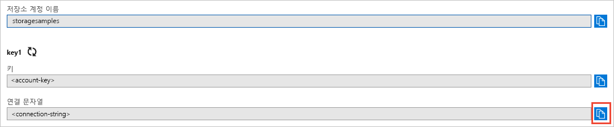

## Azure Portal에서 자격 증명 복사

애플리케이션 예제는 스토리지 계정에 대한 액세스를 인증해야 합니다. 인증하려면 연결 문자열로 응용 프로그램에 저장소 계정 자격 증명을 추가합니다. 다음 단계를 수행하여 저장소 계정 자격 증명을 봅니다.

1. [Azure Portal](https://portal.azure.com)로 이동합니다.
2. 저장소 계정을 찾습니다.
3. 저장소 계정 개요의 **설정** 섹션에서 **액세스 키**를 선택합니다. 여기에서 계정 액세스 키 및 각 키의 전체 연결 문자열을 볼 수 있습니다.   
4. **key1** 아래에서 **연결 문자열** 값을 찾고, **복사** 단추를 선택하여 연결 문자열을 복사합니다. 다음 단계에서 연결 문자열 값을 환경 변수에 추가합니다.

    
