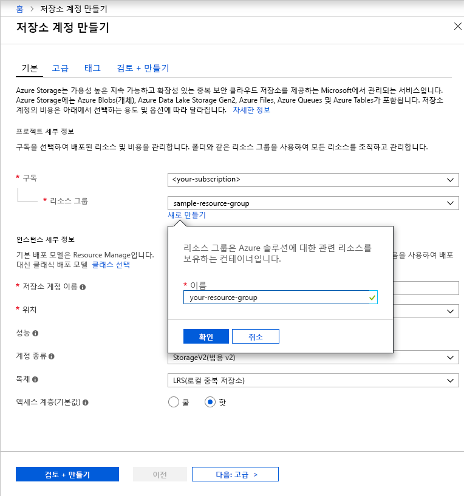

Azure Portal에서 범용 v2 저장소 계정을 만들려면 다음 단계를 수행합니다.

1. Azure Portal에서 **모든 서비스**를 선택합니다. 리소스 목록에 **저장소 계정**을 입력합니다. 입력을 시작하면 입력한 내용을 바탕으로 목록이 필터링됩니다. **Storage 계정**을 선택합니다.
1. 나타나는 **Storage 계정** 창에서 **추가**를 선택합니다.
1. 저장소 계정을 만들 구독을 선택합니다.
1. **리소스 그룹** 필드 아래에서 **새로 만들기**를 선택합니다. 다음 이미지에 표시된 대로 새 리소스 그룹의 이름을 입력합니다.

    

1. 그런 다음, 저장소 계정의 이름을 입력합니다. 선택하는 이름이 Azure에서 고유해야 합니다. 또한 이름의 길이가 3~24자여야 하고, 숫자 및 소문자만 포함할 수 있습니다.
1. 저장소 계정의 위치를 선택하거나 기본 위치를 사용합니다.
1. 다음 필드는 기본값으로 유지합니다.

   |필드  |값  |
   |---------|---------|
   |배포 모델     |리소스 관리자         |
   |성능     |Standard         |
   |계정 종류     |StorageV2(범용 v2)         |
   |복제     |LRS(로컬 중복 저장소)         |
   |액세스 계층     |핫         |

1. **검토 + 만들기**를 선택하여 저장소 계정 설정을 검토하고 계정을 만듭니다.
1. **만들기**를 선택합니다.

저장소 계정 유형 및 기타 저장소 계정 설정에 대한 자세한 내용은 [Azure Storage 계정 개요](https://docs.microsoft.com/azure/storage/common/storage-account-overview)를 참조하세요. 리소스 그룹에 대한 자세한 내용은 [Azure Resource Manager 개요](https://docs.microsoft.com/azure/azure-resource-manager/resource-group-overview)를 참조하세요. 
