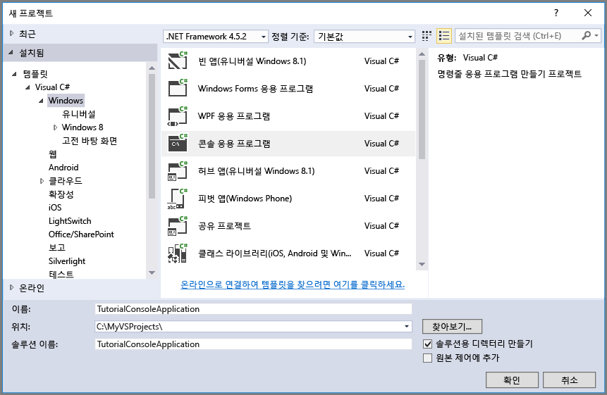

## <a name="set-up-your-development-environment"></a>개발 환경 설정
다음으로 이 가이드에 코드 예제를 사용할 준비가 되도록 Visual Studio에서 개발 환경을 설정합니다.

### <a name="create-a-windows-console-application-project"></a>Windows 콘솔 애플리케이션 프로젝트 만들기
Visual Studio에서 새로운 Windows 콘솔 애플리케이션을 만듭니다. 다음 단계에서는 Visual Studio 2017에서 콘솔 애플리케이션을 만드는 방법을 보여 줍니다. 이러한 단계는 다른 버전의 Visual Studio에서도 비슷합니다.

1. **파일** > **새로 만들기** > **프로젝트**를 선택합니다.
2. **설치됨** > **템플릿** > **Visual C#** > **Windows 클래식 바탕 화면**을 차례로 선택합니다.
3. **콘솔 앱(.NET Framework)** 을 선택합니다.
4. **이름:** 필드에서 응용 프로그램의 이름을 입력합니다.
5. **확인**을 선택합니다.



이 자습서의 모든 코드 예제는 콘솔 애플리케이션에 있는 `Program.cs` 파일의 `Main()` 메서드에 추가될 수 있습니다.

Azure 클라우드 서비스, 웹앱, 데스크톱 및 모바일 애플리케이션을 포함하여 .NET 애플리케이션의 모든 형식에서 Azure Storage 클라이언트 라이브러리를 사용할 수 있습니다. 이 가이드에서는 편의상 콘솔 애플리케이션을 사용합니다.

### <a name="use-nuget-to-install-the-required-packages"></a>NuGet을 사용하여 필요한 패키지 설치
이 자습서를 완료하기 위해 프로젝트에서 참조해야 하는 두 개의 패키지가 있습니다.

* [.NET용 Microsoft Azure Storage 클라이언트 라이브러리](https://www.nuget.org/packages/WindowsAzure.Storage/): 이 패키지는 Storage 계정에서 데이터 리소스에 프로그래밍 방식의 액세스를 제공합니다.
* [.NET용 Microsoft Azure 구성 관리자 라이브러리](https://www.nuget.org/packages/Microsoft.WindowsAzure.ConfigurationManager/): 이 패키지는 응용 프로그램을 실행하는 위치에 관계없이 구성 파일에서 연결 문자열을 구문 분석하기 위한 클래스를 제공합니다.

NuGet을 사용하여 패키지를 모두 가져올 수 있습니다. 다음 단계를 수행하세요.

1. **솔루션 탐색기**에서 프로젝트를 마우스 오른쪽 단추로 클릭하고 **NuGet 패키지 관리**를 선택합니다.
2. 온라인에서 "WindowsAzure.Storage"를 검색하고, **설치**를 선택하여 저장소 클라이언트 라이브러리와 해당 종속성을 설치합니다.
3. 온라인에서 "WindowsAzure.ConfigurationManager"를 검색하고, **설치**를 선택하여 Azure 구성 관리자를 설치합니다.

> [!NOTE]
> Storage 클라이언트 라이브러리도 [Azure SDK for.NET](https://azure.microsoft.com/downloads/)에 포함될 수 있습니다. 또한 NuGet에서 Storage 클라이언트 라이브러리를 설치하여 항상 클라이언트 라이브러리의 최신 버전이 있는지 확인하는 것이 좋습니다.
> 
> Storage Client Library for .NET의 ODataLib 종속성은 WCF Data Services가 아니라 NuGet에서 사용 가능한 ODataLib 패키지에 의해 확인됩니다. ODataLib 라이브러리는 직접 다운로드하거나 NuGet을 통해 코드 프로젝트에서 참조할 수 있습니다. Storage 클라이언트 라이브러리에서 사용되는 특정 ODataLib 패키지는 [OData](http://nuget.org/packages/Microsoft.Data.OData/), [Edm](http://nuget.org/packages/Microsoft.Data.Edm/) 및 [Spatial](http://nuget.org/packages/System.Spatial/)입니다. 이러한 라이브러리는 Azure Table Storage 클래스에서 사용하는 동안 Storage 클라이언트 라이브러리를 사용한 프로그래밍에 대 한 종속성이 필요합니다.
> 
> 

### <a name="determine-your-target-environment"></a>대상 환경 확인
이 가이드의 예제를 실행하기 위해 다음과 같은 두 가지 환경 옵션이 있습니다.

* 클라우드에서 Azure Storage 계정에 대한 코드를 실행할 수 있습니다. 
* Azure 저장소 에뮬레이터에 대해 코드를 실행할 수 있습니다. 저장소 에뮬레이터는 클라우드에서 Azure Storage 계정을 에뮬레이트하는 로컬 환경입니다. 에뮬레이터는 애플리케이션을 개발하는 동안 코드의 테스트 및 디버깅하기 위한 무료 옵션입니다. 에뮬레이터는 잘 알려진 계정 및 키를 사용합니다. 자세한 내용은 [개발 및 테스트에 Azure Storage 에뮬레이터 사용](../articles/storage/common/storage-use-emulator.md)을 참조하세요.

클라우드에서 저장소 계정을 대상으로 하는 경우 Azure Portal에서 저장소 계정에 대한 기본 선택키를 복사합니다. 자세한 내용은 [액세스 키](../articles/storage/common/storage-account-manage.md#access-keys)를 참조하세요.

> [!NOTE]
> Azure Storage와 연결하여 비용이 초래되지 않도록 저장소 에뮬레이터를 대상으로 할 수 있습니다. 그러나 클라우드에서 Azure 저장소 계정을 대상으로 하도록 선택하는 경우 이 자습서를 수행하는 비용은 무시됩니다.
> 
> 

### <a name="configure-your-storage-connection-string"></a>저장소 연결 문자열 구성
Azure Storage Client Library for .NET은 저장소 연결 문자열을 사용하여 저장소 서비스에 액세스하기 위한 엔드포인트 및 자격 증명을 구성하는 작업을 지원합니다. 저장소 연결 문자열을 유지하는 가장 좋은 방법은 구성 파일 안에 있습니다. 

연결 문자열에 대한 자세한 내용은 [Azure Storage에 연결 문자열 구성](../articles/storage/common/storage-configure-connection-string.md)을 참조하세요.

> [!NOTE]
> 저장소 계정 키는 저장소 계정의 루트 암호와 비슷합니다. 항상 저장소 계정 키를 보호해야 합니다. 다른 사용자에게 배포하거나 하드 코딩하거나 다른 사람이 액세스할 수 있는 일반 텍스트 파일에 저장하지 마십시오. 손상되었다고 생각되면 Azure Portal을 사용하여 키를 다시 생성합니다.
> 
> 

연결 문자열을 구성하려면 Visual Studio의 솔루션 탐색기에서 `app.config` 파일을 엽니다. 아래와 같이 `<appSettings>` 요소의 콘텐츠를 추가합니다. 저장소 계정의 이름으로 `account-name`을(를) 바꾸고를 계정 액세스 키로 `account-key`을(를) 바꿉니다.

```xml
<configuration>
    <startup> 
        <supportedRuntime version="v4.0" sku=".NETFramework,Version=v4.5.2" />
    </startup>
    <appSettings>
        <add key="StorageConnectionString" value="DefaultEndpointsProtocol=https;AccountName=account-name;AccountKey=account-key" />
    </appSettings>
</configuration>
```

예를 들어, 구성 설정은 다음과 유사하게 표시됩니다.

```xml
<add key="StorageConnectionString" value="DefaultEndpointsProtocol=https;AccountName=storagesample;AccountKey=GMuzNHjlB3S9itqZJHHCnRkrokLkcSyW7yK9BRbGp0ENePunLPwBgpxV1Z/pVo9zpem/2xSHXkMqTHHLcx8XRA==" />
```

저장소 에뮬레이터를 대상으로 하려면 잘 알려진 계정 이름 및 키에 매핑되는 바로 가기를 사용할 수 있습니다. 이 경우에 연결 문자열 설정은 다음과 같습니다.

```xml
<add key="StorageConnectionString" value="UseDevelopmentStorage=true;" />
```

