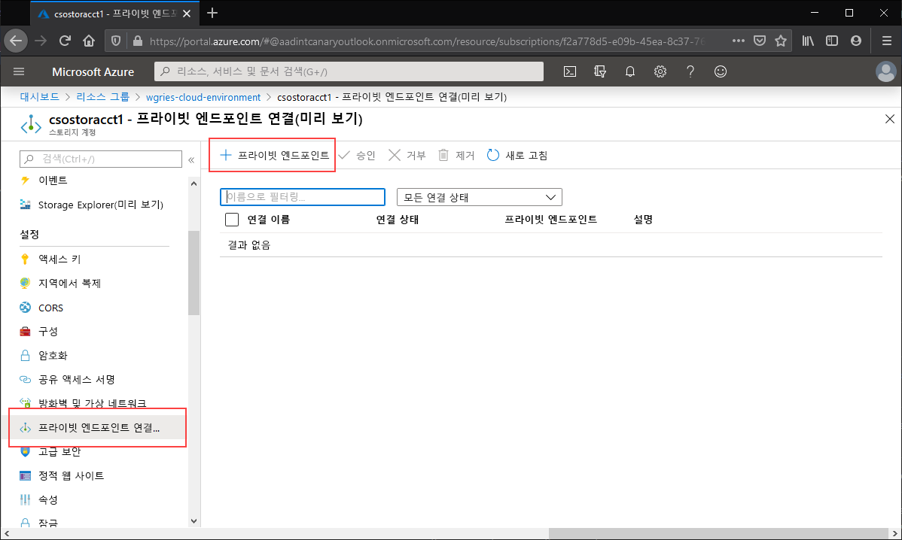
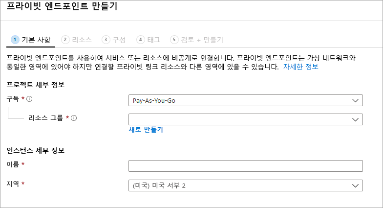
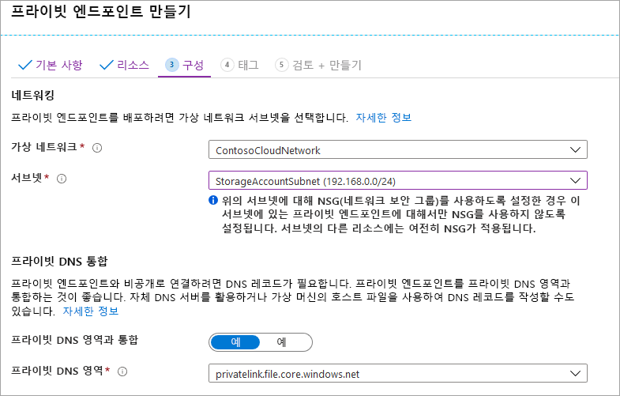

프라이빗 엔드포인트를 만들려는 스토리지 계정으로 이동합니다. 스토리지 계정의 목차에서 **프라이빗 엔드포인트 연결**을 선택한 다음, **+ 프라이빗 엔드포인트** 를 선택하여 새 프라이빗 엔드포인트를 만듭니다. 

그 결과로 마법사에는 완료할 페이지가 여러 개 있습니다.

**기본 사항** 블레이드에서 프라이빗 엔드포인트에 원하는 리소스 그룹, 이름 및 지역을 선택합니다. 이러한 항목은 원하는 대로 지정할 수 있지만 어쨌든 간에 스토리지 계정과 일치할 필요는 없습니다. 그러나 프라이빗 엔드포인트는 해당 프라이빗 엔드포인트를 만들려는 가상 네트워크와 동일한 지역에 만들어야 합니다.

**리소스** 블레이드에서 **내 디렉터리에서 Azure 리소스에 연결** 라디오 단추를 선택합니다. **리소스 종류** 아래에서 리소스 종류에 대해 **Microsoft.Storage/storageAccounts**를 선택합니다. **리소스** 필드는 연결하려는 Azure 파일 공유가 있는 스토리지 계정입니다. 대상 하위 리소스는 Azure Files용이므로 **파일**입니다.

**구성** 블레이드에서는 프라이빗 엔드포인트를 추가할 가상 네트워크 및 서브넷을 선택할 수 있습니다. 위에서 서비스 엔드포인트를 추가한 서브넷과 다른 별도의 서브넷을 선택해야 합니다. 구성 블레이드에는 프라이빗 DNS 영역을 만들거나 업데이트하기 위한 정보도 포함되어 있습니다. 기본 `privatelink.file.core.windows.net` 영역을 사용하는 것이 좋습니다.

**검토 + 만들기**를 클릭하여 프라이빗 엔드포인트를 만듭니다. 