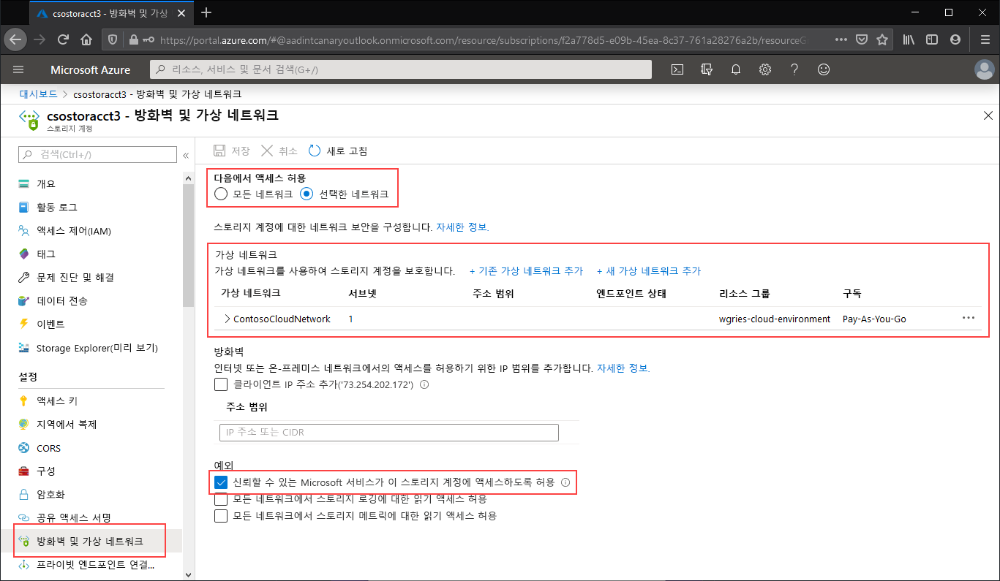

퍼블릭 엔드포인트를 특정 가상 네트워크로 제안하려는 스토리지 계정으로 이동합니다. 스토리지 계정의 목차에서 **네트워킹** 을 선택합니다. 

페이지 위쪽에서 **선택한 네트워크** 라디오 단추를 선택합니다. 그러면 퍼블릭 엔드포인트의 제한을 제어할 수 있는 여러 설정이 표시됩니다. **+기존 가상 네트워크 추가** 를 클릭하여 퍼블릭 엔드포인트를 통해 스토리지 계정에 액세스할 수 있도록 허용해야 하는 가상 네트워크를 선택합니다. 이렇게 하려면 가상 네트워크를 선택하고 해당 가상 네트워크의 서브넷을 선택해야 합니다. 

**신뢰할 수 있는 Microsoft 서비스가 이 서비스 계정에 액세스할 수 있도록 허용** 을 선택하여 Azure 파일 동기화와 같은 신뢰할 수 있는 자사 Microsoft 서비스에서 스토리지 계정에 액세스할 수 있도록 허용합니다.

