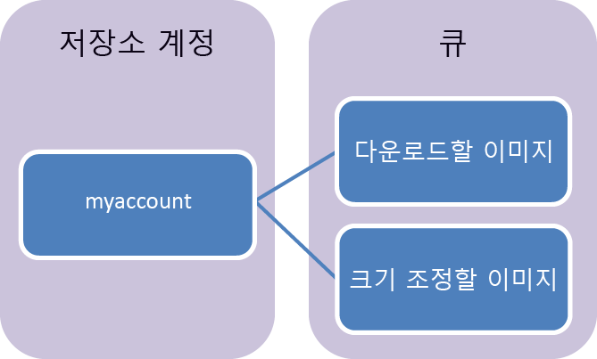

## Queue Storage 정의
Azure Queue Storage는 HTTP 또는 HTTPS를 사용하여 인증된 호출을 통해 전 세계 어디에서나 액세스할 수 있는 다수의 메시지를 저장하기 위한 서비스입니다. 단일 큐 메시지의 크기는 최대 64KB일 수 있으며, 하나의 큐에 저장소 계정의 총 용량 제한까지 수백만 개의 메시지가 포함될 수 있습니다.

Queue Storage의 일반적인 사용은 다음과 같습니다.

* 비동기적으로 처리할 작업 백로그 만들기
* Azure 웹 역할에서 Azure 작업자 역할로 메시지 전달

## 큐 서비스 개념
큐 서비스에는 다음 구성 요소가 포함됩니다.

* **URL 형식:** 다음 URL 형식을 사용하여 큐에 주소를 지정할 수 있습니다.   
    http://`<storage account>`.queue.core.windows.net/`<queue>` 
  
    다음 URL은 다이어그램에 있는 큐의 주소를 지정합니다.  
  
    `http://myaccount.queue.core.windows.net/images-to-download`

* **스토리지 계정:** Azure Storage에 대한 모든 액세스는 Storage 계정을 통해 수행됩니다. Storage 계정 용량에 대한 자세한 내용은 [Azure Storage 확장성 및 성능 목표](../articles/storage/common/storage-scalability-targets.md) (영문)를 참조하십시오.
* **큐:** 큐에는 메시지 세트가 포함됩니다. 모든 메시지는 큐에 있어야 합니다. 큐 이름은 모두 소문자여야 합니다. 큐의 명명에 대한 자세한 내용은 [큐 및 메타데이터 명명](https://msdn.microsoft.com/library/azure/dd179349.aspx)을 참조하세요.
* **메시지:** 최대 64KB인 임의 형식의 메시지입니다. 메시지가 큐에 남아 있을 수 있는 최대 시간은 7일입니다.

