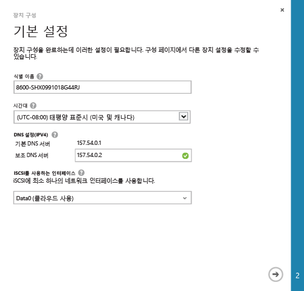
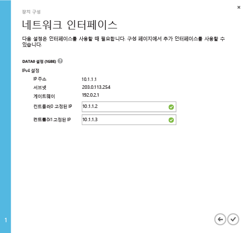

#### 최소 StorSimple 장치 설치를 완료하려면

1. 장치를 선택하고 **퀵 스타트**를 클릭합니다. **장치 설치 완료**를 클릭하여 장치 구성 마법사를 시작합니다.

2. 장치 구성 마법사의 **기본 설정** 대화 상자에서 다음을 수행합니다.
  1. 장치의 **이름**을 제공합니다. 기본 장치 이름은 장치 모델 및 일련 번호와 같은 정보를 반영합니다. 최대 64자의 친숙한 이름을 할당하여 장치를 관리할 수 있습니다.
  2. 장치가 배포되는 지리적 위치에 기반한 **표준 시간대**를 설정합니다. 장치는 모든 예약된 작업에 대해 이 표준 시간대를 사용합니다.
  3. **DNS 설정** 아래에서 **보조 DNS 서버**의 주소를 제공합니다. IPv6를 사용하는 경우 Windows PowerShell 인터페이스에서 제공하는 IPv6 접두사에 따라 필드가 채워집니다. 보조 DNS 서버를 구성하지 않은 경우 장치 구성을 저장할 수 없습니다.
  4. iSCSI 사용 인터페이스에서 iSCSI에 하나 이상의 네트워크를 사용하도록 설정합니다. 하나 이상의 네트워크 인터페이스는 클라우드를 사용할 수 있도록 설정하며 하나의 인터페이스는 iSCSI를 사용할 수 있도록 설정해야 합니다. 데이터 0은 클라우드를 사용할 수 있도록 자동으로 설정됩니다.
 
      

3. 화살표 아이콘을 클릭합니다.

4. **네트워크 인터페이스** 대화 상자에서 컨트롤러 0과 컨트롤러 1에 대한 고정 IP 주소를 제공합니다. **컨트롤러 고정 IP 주소는 장치 IP 주소를 통해 접근할 수 있는 서브넷 내의 사용 가능한 IP여야 합니다.** 데이터 0 인터페이스가 IPv4에 대해 구성된 경우 고정 IP 주소는 IPv4 형식으로 제공해야 합니다. IPv6 구성에 대한 접두사를 제공하는 경우 고정 IP 주소는 이러한 필드에 자동으로 채워집니다.

    컨트롤러에 대한 고정 IP 주소는 장치에 대한 업데이트 서비스를 위해 사용되므로, 고정 IP는 라우팅할 수 있어야 하며 인터넷에 연결할 수 있어야 합니다.

    

5. 확인 아이콘을 클릭합니다. 장치 **퀵 스타트** 페이지로 돌아갑니다.

 >[AZURE.NOTE]**구성** 페이지에 액세스하여 언제든지 다른 모든 장치 설정을 수정할 수 있습니다.

<!---HONumber=July15_HO4-->