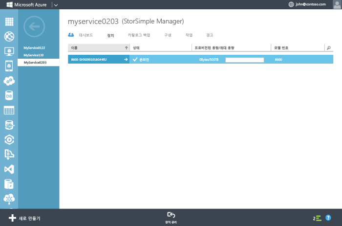

### 장치를 구성 및 등록하려면

1. StorSimple 장치 직렬 콘솔에서 Windows PowerShell 인터페이스에 액세스합니다. 지침은 [장치 직렬 콘솔 연결에 PuTTY 사용](#use-putty-to-connect-to-the-device-serial-console)을 참조하세요. **과정을 정확하게 따르지 않으면 콘솔에 액세스할 수 없습니다.**

2. 열린 세션에서 Enter를 한 번 눌러 명령 프롬프트를 엽니다.

3. 장치에 설정하려는 언어를 선택하라는 메시지가 표시됩니다. 언어를 지정하고 Enter를 누릅니다.

    

4. 표시되는 직렬 콘솔 메뉴에서 모든 권한으로 로그온할 수 있는 옵션 1을 선택합니다.

    
  
     5\~12단계를 완료하여 장치에 필요한 최소 네트워크 설정을 구성합니다. **이러한 구성 단계는 장치의 활성 컨트롤러에서 수행해야 합니다.** 직렬 콘솔 메뉴는 배너 메시지에 컨트롤러 상태를 나타냅니다. 활성 컨트롤러에 연결되지 않은 경우 연결을 끊고 활성 컨트롤러에 연결합니다.

5. 명령 프롬프트에 암호를 입력합니다. 기본 장치 암호는 **Password1**입니다.

6. 다음 명령을 입력합니다. `Invoke-HcsSetupWizard`

7. 장치에 대한 네트워크 설정 구성을 도와주는 설치 마법사가 나타납니다. 다음 정보를 지정합니다.
   - 데이터 0 네트워크 인터페이스의 IP 주소
   - 서브넷 마스크
   - 게이트웨이
   - 주 DNS 서버의 IP 주소
    
		Note that the system is validating network settings after each step in the process.
   
      >[AZURE.NOTE]서브넷 마스크 및 DNS 설정을 적용하려면 몇 분간 대기할 수 있습니다. "데이터 0에 대한 네트워크 연결을 확인합니다." 오류 메시지를 받게되면, 활성 컨트롤러의 데이터 0 네트워크 인터페이스에서 실제 네트워크 연결을 확인합니다.

8. (선택 사항) 웹 프록시 서버를 구성합니다. 웹 프록시 구성은 선택 사항이지만 **웹 프록시를 사용하면 여기서만 구성할 수 있습니다**. 자세한 내용은 [장치에 웹 프록시 구성](https://msdn.microsoft.com/library/azure/dn764937.aspx)으로 이동합니다.

9. 장치에 대한 기본 NTP 서버를 구성합니다. 클라우드 서비스 공급자와 인증할 수 있도록 장치 시간을 동기화해야 하는 것처럼 NTP 서버가 필요합니다. 네트워크에서 NTP 트래픽이 데이터 센터에서 인터넷으로 전달되도록 허용하는지 확인합니다. 허용되지 않는 경우 내부 NTP 서버를 지정합니다.
 
10. 보안상의 이유로 첫 번째 세션이 끝난 후 장치 관리자 암호가 만료되고 지금 암호를 변경해야 합니다. 메시지가 표시되면 장치 관리자 암호를 제공합니다. 유효한 장치 관리자 암호는 8자에서 15자 사이여야 합니다. 암호는 소문자, 대문자, 숫자 및 특수 문자 중 세 유형을 포함해야 합니다.

	 

11. 설치 마법사의 마지막 단계에서는 StorSimple 관리자 서비스에 장치를 등록합니다. 이 경우 2단계에서 얻은 서비스 등록 키가 필요합니다. 등록 키를 입력한 후 장치가 등록되려면 2\~3분 정도 기다려야 할 수 있습니다.

      >[AZURE.NOTE]Ctrl + C를 눌러 언제든지 설치 마법사를 종료할 수 있습니다. 모든 네트워크 설정(Data 0, 서브넷 마스크 및 게이트웨이 IP 주소)를 입력한 경우, 항목이 유지됩니다.

	

12. 장치를 등록한 후 서비스 데이터 암호화 키가 표시됩니다. 이 키를 복사하고 안전한 위치에 저장합니다. **이 키는 StorSimple 관리자 서비스로 추가 장치를 등록하기 위한 서비스 등록 키에 필요합니다.** 이 키에 대한 자세한 내용은 [StorSimple 보안](../articles/storsimple/storsimple-security.md)을 참조하세요.
	
	

      >[AZURE.NOTE]직렬 콘솔 창에서 텍스트를 복사하려면 해당 텍스트를 선택하면 됩니다. 그런 다음 클립보드 또는 임의의 텍스트 편집기에 붙여넣을 수 있습니다. Ctrl + C를 사용하여 서비스 데이터 암호화 키를 복사하지 마십시오. Ctrl + C를 사용하면 설치 마법사가 종료됩니다. 결과적으로, 장치 관리자 암호는 변경되지 않으며 장치는 기본 암호로 되돌아갑니다.

13. 직렬 콘솔을 종료합니다.

14. 관리 포털로 돌아가 다음 단계를 완료합니다.
  1. StorSimple 관리자 서비스를 두 번 클릭하여 **퀵 스타트** 페이지에 액세스합니다.
  2. **연결된 장치 보기**를 클릭합니다.
  3. **장치** 페이지에서 상태를 조회하여 장치가 서비스에 성공적으로 연결되었는지 확인합니다. 장치 상태는 **온라인**이어야 합니다.
   
    	 
  
        If the device status is **Offline**, wait for a couple of minutes for the device to come online. 
      
        If the device is still offline after a few minutes, then you need to make sure that your firewall network was configured as described in the [network requirements for your StorSimple device](https://msdn.microsoft.com/library/dn772371.aspx). If you do not have HTTP 1.1 support, check port 9354 to make sure that it is open for outbound communication. This port is used for communication between the StorSimple Manager service and your StorSimple device.
     
       

<!---HONumber=July15_HO5-->