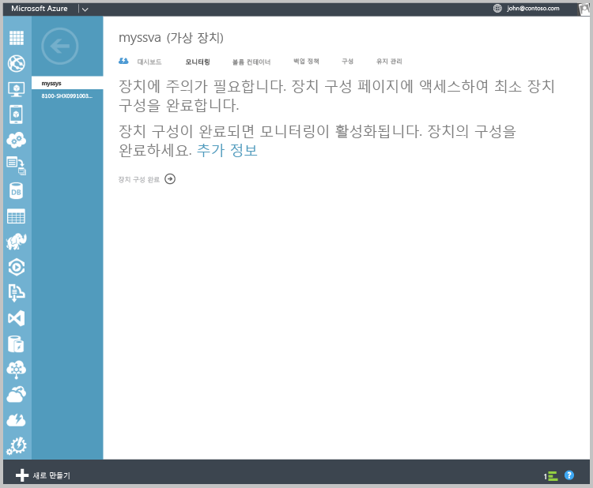
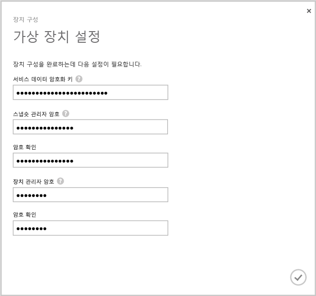
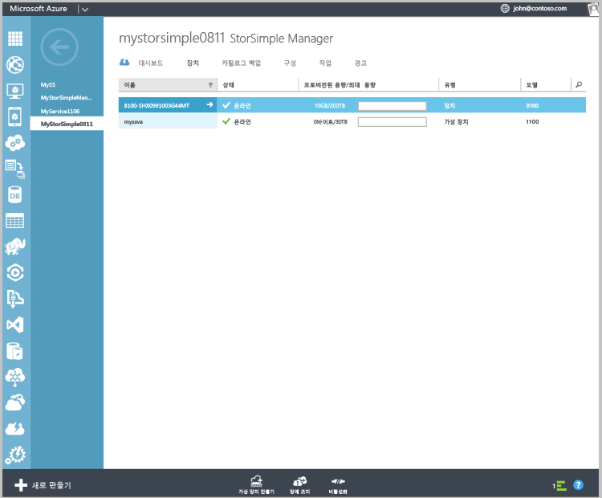

<!---author: alkohli, last updated: 11/05/2015 --->

가상 장치를 구성 및 등록하려면

1. 장치 페이지에서 방금 만든 **StorSimple 가상 장치** 를 선택합니다. 
2. **장치 설치 완료**를 클릭합니다. 그러면 장치 구성 마법사가 시작됩니다.
   
    
    
3. **서비스 데이터 암호화 키** 를 제공한 공간에 입력합니다.
4. 지정된 길이 및 설정의 스냅숏 관리자 및 장치 관리자 암호를 입력합니다.
5. 가상 장치의 초기 구성 및 등록을 완료하려면 확인 표시를 클릭합니다. 
   
    

구성 및 등록이 완료된 후에 장치가 온라인 상태가 됩니다. 장치가 온라인 상태로 전환되는 데 몇 분 정도 걸릴 수 있습니다.

<!--HONumber=Nov16_HO2-->

