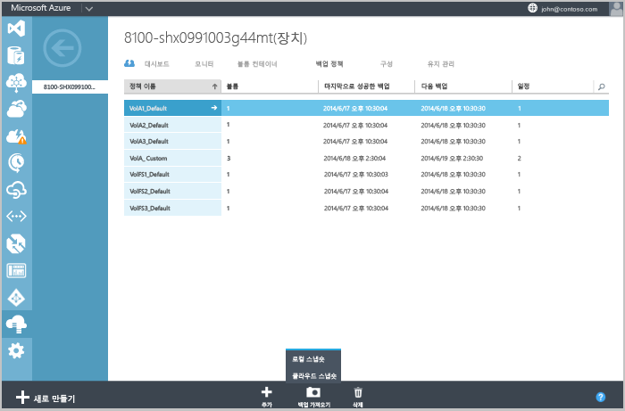
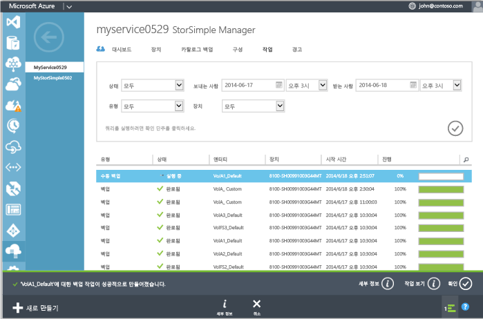

<!--author=SharS last changed: 9/15/15-->

#### 수동 백업을 만들려면
1. **장치** 페이지에서 **백업 정책** 탭으로 이동합니다. 이 탭에는 백업하려는 볼륨에 대한 정책을 비롯한 테이블 형식의 모든 백업 정책이 나열됩니다.
2. 첫 번째 열을 제외하고 해당 행에서 아무 곳이나 클릭하여 정책을 선택합니다. 페이지 맨 아래에 있는 **백업 수행**을 클릭합니다. 백업 옵션을 표시하도록 단추가 확장됩니다(로컬 스냅숏 및 클라우드 스냅숏). 
3. 이러한 옵션 중 하나를 선택하면 확인을 묻는 메시지가 나타납니다. **예**를 클릭합니다. 
   
    
   
    스냅숏을 만들기 위한 작업이 시작됩니다. 작업이 성공적으로 만들어진 후 페이지 맨 아래에 알림이 표시됩니다.
4. 작업을 모니터링하려면 알림 영역(페이지 맨 아래)에서 **작업 보기** 를 클릭합니다. 
   
    
5. 백업 작업이 완료되면 **백업 카탈로그** 탭으로 이동합니다.
6. 적절한 장치, 백업 정책 및 시간 범위로 필터 선택을 설정합니다. 필터 설정 후에 확인 아이콘  을 클릭합니다.
   
   카탈로그에 표시되는 백업 세트의 목록에 백업이 나타납니다.

