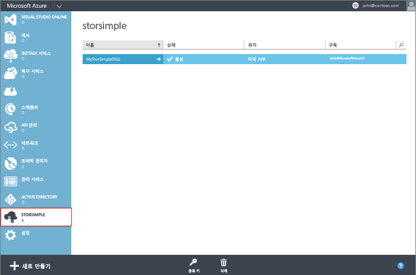

<!--author=alkohli last changed:01/14/2016-->

#### 새 서비스를 만들려면

1. URL [https://manage.windowsazure.com/](https://manage.windowsazure.com/)에서 Microsoft 계정 자격 증명을 사용하여 Azure 클래식 포털에 로그온합니다.

2. Azure 클래식 포털에서 **새로 만들기** > **데이터 서비스** > **StorSimple 관리자** > **빠른 생성**을 클릭합니다.

3. 표시되는 양식에서 다음을 수행합니다.
  1. 서비스에 고유한 **이름**을 지정합니다. 이 이름은 서비스를 식별하는 데 사용할 수 있는 친숙한 이름입니다. 이름은 문자, 숫자 및 하이픈이 될 수 있는 2자에서 50자 사이여야 합니다. 이름은 문자 또는 숫자로 시작하고 끝나야 합니다.
  2. 서비스의 **위치**를 지정합니다. 일반적으로 장치를 배포하려는 지리적 지역에 가장 가까운 위치를 선택합니다. 다음 사항을 고려할 수도 있습니다. 
	 
		- If you have existing workloads in Azure that you also intend to deploy with your StorSimple device, you should use that datacenter.
		- Your StorSimple Manager service and Azure storage can be in two separate locations. In such a case, you are required to create the StorSimple Manager and Azure storage account separately. To create an Azure storage account, go to the Azure Storage service in the Azure classic portal and follow the steps in [Create an Azure Storage account](storage-create-storage-account.md#create-a-storage-account). After you create this account, add it to the StorSimple Manager service by following the steps in [Configure a new storage account for the service](storsimple-deployment-walkthrough.md#configure-a-new-storage-account-for-the-service).
		 
  3. 드롭다운 목록에서 **구독**을 선택합니다. 구독은 대금 청구 계정에 연결됩니다. 이 필드는 구독이 하나만 있는 경우에는 나타나지 않습니다.
  4. **새 저장소 계정 만들기**를 선택하여 서비스를 포함하는 저장소 계정을 자동으로 만듭니다. 이 저장소 계정에는 "storsimplebwv8c6dcnf"와 같은 특수한 이름이 주어집니다. 다른 위치에 있는 데이터가 필요하면 확인란의 선택을 취소합니다. 
  5. **StorSimple 관리자 만들기**를 클릭하여 서비스를 만듭니다.

   

  **서비스** 방문 페이지로 이동됩니다. 서비스 만들기에는 몇 분 정도 소요됩니다. 서비스가 성공적으로 만들어진 후 적절하게 알림이 표시되며 서비스 상태가 **활성**으로 변경됩니다.
 
   

 **동영상 사용 가능**

새 StorSimple Manager 서비스를 만드는 방법을 보여 주는 동영상을 시청하려면 [여기](https://azure.microsoft.com/documentation/videos/create-a-storsimple-manager-service/)를 클릭하세요.

<!---HONumber=AcomDC_0128_2016-->