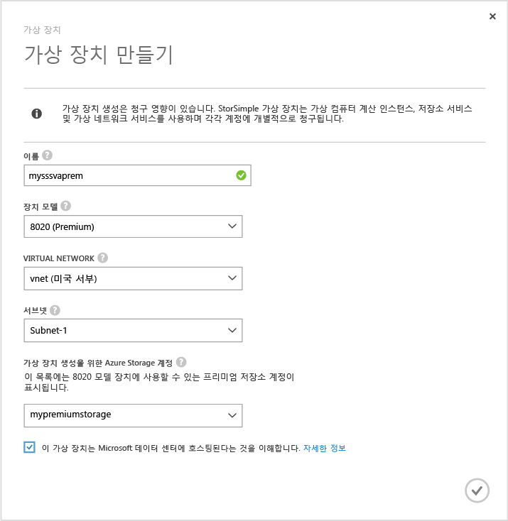
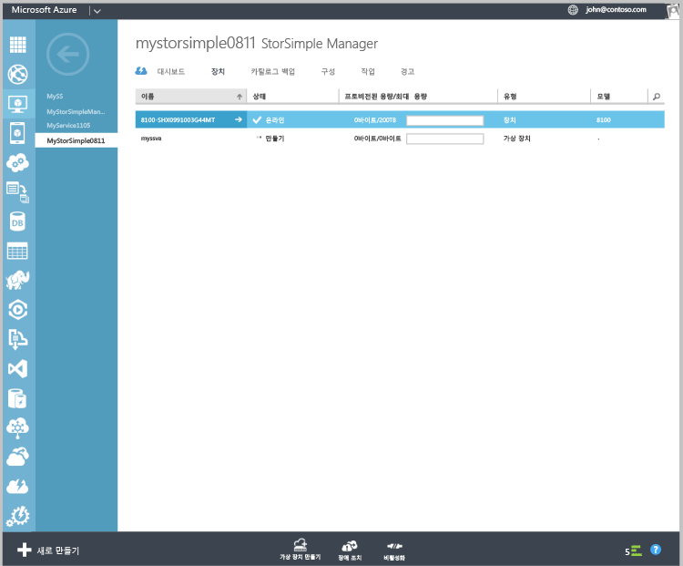

#### 가상 장치를 만들려면
1. Azure 포털에서 **StorSimple Manager** 서비스로 이동합니다.
2. **장치** 페이지로 이동합니다. **장치** 페이지 맨 아래의 **가상 장치 만들기**를 클릭합니다.
3. **가상 장치 만들기**대화 상자에서 다음 정보를 지정합니다.
   
     
   
   1. **이름** – 가상 장치에 대한 고유 이름입니다.
   2. **모델** - 가상 장치의 모델을 선택합니다. 이 필드는 업데이트 2 이상을 실행하는 경우에만 표시됩니다. 8010 장치 모델은 30TB의 표준 저장소를 제공하는 반면, 8020에는 64TB의 프리미엄 저장소가 있습니다. 백업에서
   3. 항목 수준 검색 시나리오를 배포하려면 8010을 지정합니다. 성능이 높고 대기 시간이 짧은 워크로드를 배포하거나 재해 복구용 보조 장치로 사용하려면 8020을 지정합니다.
   4. **버전** - 가상 장치의 버전을 선택합니다. 8020 장치 모델을 선택한 경우에는 버전 필드가 사용자에게 표시되지 않습니다. 이 서비스에 등록된 모든 물리적 장치에서 업데이트 1 이상을 실행하는 경우에는 이 옵션이 없습니다. 이 필드는 동일한 서비스에 등록된 물리적 장치의 버전이 사전 업데이트 1과 업데이트 1이 조합된 경우에만 표시됩니다. 지정된 가상 장치의 버전은 장애 조치 또는 복제할 수 있는 물리적 장치를 결정합니다. 이는 적합한 가상 장치 버전을 만드는 데에 중요합니다. 선택:
      
      * 업데이트 0.3 이상을 실행하는 물리적 장치에서 장애 조치(Failover)하거나 DR하려는 경우 버전 업데이트 0.3을 선택합니다. 
      * 업데이트 1 이상을 실행하는 물리적 장치에서 장애 조치(Failover)하거나 복제하려는 경우 버전 업데이트 1을 선택합니다. 
   5. **가상 네트워크** –이 가상 장치에 사용하려는 가상 네트워크를 지정합니다. 프리미엄 저장소(업데이트 2 이상)를 사용하는 경우에는 프리미엄 저장소 계정에 지원되는 가상 네트워크를 선택해야 합니다. 지원되지 않는 가상 네트워크는 드롭다운 목록에서 회색으로 처리됩니다. 지원되지 않는 가상 네트워크를 선택한 경우 경고 메시지가 표시됩니다. 
   6. **가상 장치를 만들기 위한 저장소 계정** – 프로비전하는 동안 가상 장치의 이미지를 유지할 저장소 계정을 선택합니다. 이 저장소 계정은 가상 장치 및 가상 네트워크와 동일한 지역에 있어야 합니다. 물리적 장치나 가상 장치에서 데이터 저장소에 사용해서는 안됩니다. 기본적으로 새 저장소 계정은 이 용도로 만들어집니다. 그러나 이 용도에 적합한 저장소 계정을 이미 알고 있는 경우 목록에서 선택할 수 있습니다. 프리미엄 가상 장치를 만드는 경우에는 드롭다운 목록에 프리미엄 저장소 계정만 표시됩니다. 
      
      > [!NOTE]
      > 가상 장치는 Azure 저장소 계정으로만 동작할 수 있습니다. Amazon, HP 및 OpenStack(물리적 장치에 지원됨)과 같은 기타 클라우드 서비스 공급자는 StorSimple 가상 장치를 지원하지 않습니다.
      > 
      > 
   7. 가상 장치에 저장된 데이터를 Microsoft 데이터 센터에서 호스팅함을 이해했음을 표시하려면 확인 표시를 클릭합니다. 물리적 장치만 사용하는 경우, 암호화 키는 사용자 장치와 함께 유지되므로 Microsoft는 해독할 수 없습니다. 
      
       가상 장치를 사용하면 Microsoft Azure에 암호화 키와 암호 해독 키 모두가 저장됩니다. 자세한 내용은 [가상 장치를 사용하기 위한 보안 고려 사항](../articles/storsimple/storsimple-security.md#storsimple-virtual-device-security)을 참조하세요.
   8. 확인 아이콘을 클릭하여 가상 장치를 만듭니다. 장치를 프로비전하는 데 30분 정도 걸릴 수 있습니다.
      
      

<!--HONumber=Nov16_HO2-->

