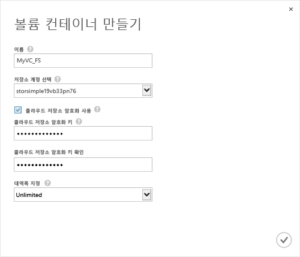

<!--author=SharS last changed: 9/17/15-->

#### 볼륨 컨테이너를 만들려면
1. 장치 **빠른 시작** 페이지에서 **볼륨 컨테이너 추가**를 클릭합니다. **볼륨 컨테이너 만들기** 대화 상자가 나타납니다.
   
    
2. **볼륨 컨테이너 만들기** 대화 상자에서:
   
   1. 볼륨 컨테이너의 **이름** 을 지정합니다. 이름은 3~32자 길이여야 합니다.
   2. **저장소 계정** 을 선택하여 이 볼륨 컨테이너와 연결합니다. 서비스를 만들 때 생성되는 기본 계정을 선택할 수 있습니다. **새로 추가** 옵션을 사용하여 이 서비스 구독에 연결되지 않은 저장소 계정을 지정할 수도 있습니다.
   3. **클라우드 저장소 암호화 사용** 을 선택하여 장치에서 클라우드로 보낸 데이터의 암호화를 사용합니다.
   4. 8~32자 길이의 **클라우드 저장소 암호화 키** 를 제공 및 확인합니다. 이 키는 암호화된 데이터에 액세스하는 장치가 사용합니다.
   5. 사용 가능한 모든 대역폭을 사용하려는 경우 **대역폭 지정** 드롭다운 목록에서 **제한 없음**을 선택합니다. 이 옵션을 **사용자 지정** 으로 설정하여 대역폭 제어를 사용하고 1~1,000Mbps 사이의 값을 지정할 수도 있습니다. 
      사용 가능한 대역폭 사용 정보가 있는 경우 **대역폭 템플릿 선택**을 지정하여 일정에 따라 대역폭을 할당할 수 있습니다. 단계별 절차의 경우 [대역폭 템플릿 추가](../articles/storsimple/storsimple-manage-bandwidth-templates.md#add-a-bandwidth-template)로 이동합니다.
   6. 확인 아이콘  을 클릭하여 이 볼륨 컨테이너를 저장하고 마법사를 종료합니다. 
   
   새로 만들어진 볼륨 컨테이너가 **볼륨 컨테이너** 페이지에 나열됩니다.

 **동영상 사용 가능**

StorSimple 솔루션에서 볼륨 컨테이너를 만드는 방법을 보여 주는 동영상을 시청하려면 [여기](https://azure.microsoft.com/documentation/videos/create-a-volume-container-in-your-storsimple-solution/)를 클릭하세요.

