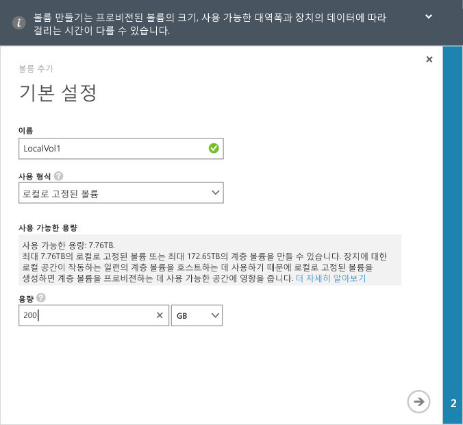
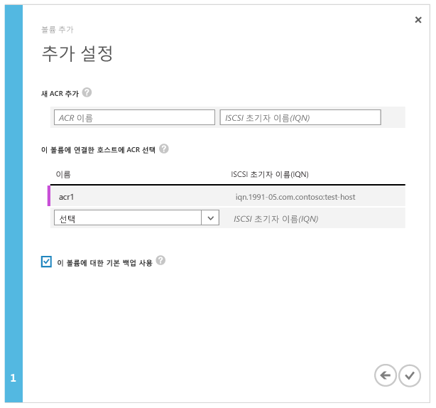

<!--author=alkohli last changed: 08/16/2016-->

#### 볼륨을 만들려면

1. 장치 **빠른 시작** 페이지에서 **볼륨 추가**를 클릭하여 볼륨 마법서 추가를 시작합니다.

2. 추가 볼륨 마법사의 **기본 설정**에서:

	4. 볼륨의 **이름**을 입력합니다.
	5. 드롭다운 목록에서 볼륨의 **사용 유형**을 선택합니다. 로컬 보증, 낮은 대기 시간 및 높은 성능이 필요한 워크로드의 경우 **로컬로 고정** 볼륨을 선택합니다. 다른 모든 데이터에 대해서는 **계층화됨** 볼륨을 선택합니다. 아카이브 데이터에 이 볼륨을 사용하려면 **자주 액세스하지 않는 아카이브 데이터에 대해 이 볼륨 사용**을 선택합니다.
	
		로컬로 고정된 볼륨은 씩 프로비전되며, 볼륨의 기본 데이터가 장치에 로컬로 유지되고 클라우드로 유출되지 않습니다. 로컬로 고정된 볼륨을 만드는 경우 장치에서는 요청된 크기의 볼륨을 프로비전하기 위해 로컬 계층에서 사용 가능한 공간을 확인합니다. 로컬로 고정된 볼륨을 만드는 작업에는 장치에서 클라우드로 기존 데이터를 분산하는 과정이 포함될 수 있으므로 볼륨을 만드는 데 시간이 오래 걸릴 수 있습니다. 전체 시간은 프로비전되는 볼륨의 크기, 사용 가능한 네트워크 대역폭 및 장치의 데이터에 따라 달라집니다.

		계층화된 볼륨은 씬 프로비전되며 빠르게 만들 수 있습니다. 아카이브 데이터를 대상으로 하는 계층화된 볼륨에 **자주 액세스하지 않는 아카이브 데이터에 이 볼륨 사용**을 선택하면 볼륨의 중복 제거 청크 크기가 512KB로 변경됩니다. 이 필드를 선택하지 않으면 해당 계층화된 볼륨에서 64KB의 청크 크기를 사용합니다. 중복 제거 청크 크기를 늘리면 장치에서 대용량 아카이브 데이터를 클라우드로 신속하게 전송할 수 있습니다.

	3. 볼륨의 **프로비전된 용량**을 지정합니다. 선택한 볼륨 유형에 따라 사용할 수 있는 용량을 적어 둡니다. 지정된 볼륨 크기는 사용 가능한 공간을 초과하지 않아야 합니다.

		8100 장치에서 로컬로 고정된 볼륨은 최대 8.5TB, 계층화된 볼륨은 최대 200TB까지 프로비전할 수 있습니다. 더 큰 8600 장치에서 로컬로 고정된 볼륨은 최대 22.5TB, 계층화된 볼륨은 최대 500TB까지 프로비전할 수 있습니다. 장치의 로컬 공간은 계층화된 볼륨의 작업 집합을 호스트하는 데 필요하므로 로컬로 고정된 볼륨을 만들면 계층화된 볼륨을 프로비전하는 데 사용할 수 있는 공간이 영향을 받습니다. 따라서 로컬로 고정된 볼륨을 만드는 경우 계층화된 볼륨을 만드는 데 사용할 수 있는 공간이 줄어듭니다. 마찬가지로 계층화된 볼륨을 만드는 경우 로컬로 고정된 볼륨을 만드는 데 사용할 수 있는 공간이 줄어듭니다.

		8100 장치에 8.5TB(최대 허용 크기)의 로컬 고정 볼륨을 프로비전하면 해당 장치에서 사용 가능한 로컬 공간이 모두 소진됩니다. 따라서 계층화된 볼륨의 작업 집합을 호스트할 로컬 공간이 장치에 없기 때문에 더 이상 계층화된 볼륨을 만들 수 없습니다. 기존 계층화된 볼륨도 사용 가능한 공간에 영향을 줍니다. 예를 들어 대략 106TB의 계층화된 볼륨이 있는 8100 장치에서는 로컬 고정 볼륨에 대해 4TB의 공간만 사용할 수 있습니다.

        다음 그림에서는 로컬로 고정된 볼륨에 대한 **기본 설정** 대화 상자를 보여 줍니다.

         

        다음 그림에서는 계층화된 볼륨에 대한 **기본 설정** 대화 상자를 보여 줍니다.

         

   4. 화살표 아이콘을 클릭하여 다음 페이지로 이동합니다.

3. **추가 설정** 대화 상자에서 새 ACR(액세스 제어 레코드)을 추가합니다.

	1. ACR의 **이름**을 지정합니다.
	2. **iSCSI 초기자 이름**에서 Windows 호스트의 IQN(정규화된 iSCSI 이름)을 제공합니다. IQN이 없는 경우 [Windows Server 호스트의 IQN 가져오기](#get-the-iqn-of-a-windows-server-host)로 이동합니다.
	3. **이 볼륨에 대해 기본 백업하겠습니까?**에서 **사용** 확인란을 선택합니다. 기본 백업은 매일 22:30(장치 시간)에 실행되며 이 볼륨의 클라우드 스냅숏을 만드는 정책을 만듭니다.
	 
     > [AZURE.NOTE] 여기서 백업이 활성화된 후에는 되돌릴 수 없습니다. 이 설정을 수정하려면 볼륨을 편집해야 합니다.

     

4. 확인 아이콘을 클릭합니다. 지정한 설정으로 볼륨이 만들어집니다.

<!-----HONumber=AcomDC_0914_2016-->