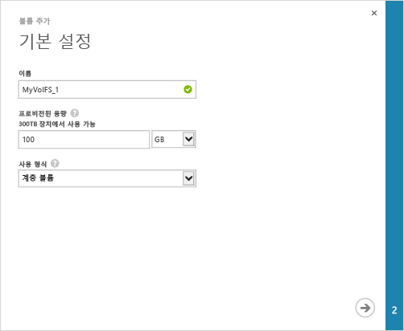
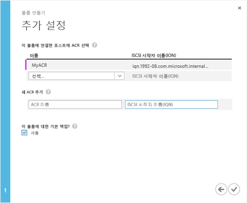

#### 볼륨을 만들려면

1. 장치 **퀵 스타트** 페이지에서 클릭 **볼륨 추가**를 클릭합니다. 추가 볼륨 마법사가 시작됩니다.

2. 추가 볼륨 마법사의 **기본 설정**에서:
   1. 볼륨의 **이름**을 입력합니다.
   2. 볼륨의 **프로비전된 용량**을 지정합니다. **볼륨 용량은 1GB 및 64TB 사이여야 합니다.**
   3. 드롭다운 목록에서 볼륨의 **사용 유형**을 선택합니다. 자주 액세스하지 않는 보관 데이터의 경우 **보관 볼륨**을 선택합니다. 다른 모든 형식의 데이터에 대해서는 **계층화된 볼륨**을 선택합니다. (계층화된 볼륨이 이전에는 기본 볼륨이었습니다.)
   4. 화살표 아이콘을 클릭하여 다음 페이지로 이동합니다.

     

3. **추가 설정** 대화 상자에서 새 ACR(액세스 제어 레코드)을 추가합니다.
   1. ACR의 **이름**을 지정합니다.
   2. **iSCSI 초기자 이름**에서 Windows 호스트의 IQN(정규화된 iSCSI 이름)을 제공합니다. IQN이 없는 경우 [Windows Server 호스트의 IQN 가져오기](#get-the-iqn-of-a-windows-server-host)로 이동합니다.
   3. **이 볼륨에 대해 기본 백업하겠습니까?**에서 **사용** 확인란을 선택합니다. 기본 백업은 매일 22:30(장치 시간)에 실행되며 이 볼륨의 클라우드 스냅숏을 만드는 정책을 만듭니다.

     >[AZURE.NOTE]여기서 백업이 활성화된 후에는 되돌릴 수 없습니다. 이 설정을 수정하려면 볼륨을 편집해야 합니다.

     

4. 확인 아이콘을 클릭합니다. 지정한 설정으로 볼륨이 만들어집니다.

<!---HONumber=August15_HO9-->