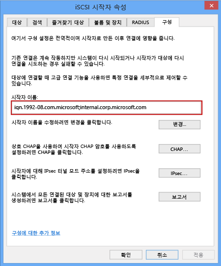

#### Windows Server 호스트의 IQN을 가져오려면
1. Windows 호스트에서 Microsoft iSCSI 초기자를 시작합니다. **시작** > **관리 도구** > **iSCSI 초기자**를 클릭합니다.
2. **iSCSI 초기자 속성** 창의 **구성** 탭에서 **초기자 이름** 필드의 문자열을 선택하고 복사합니다.
   
    
3. 이 문자열을 저장합니다.

