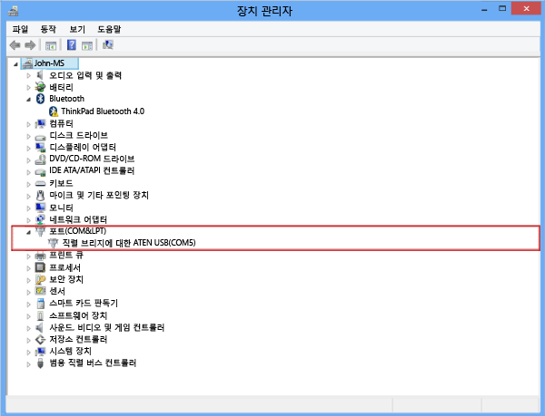
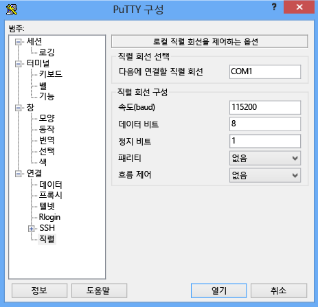

#### 직렬 콘솔을 통해 연결하려면
1. 직렬 케이블을 직접 디바이스에 연결하거나 USB 직렬 어댑터를 통해 연결합니다.
2. **제어판**, **디바이스 관리자**를 차례로 엽니다.
3. 다음 그림에 표시된 대로 COM 포트를 식별합니다.
   
     
4. PuTTY를 시작합니다. 
5. 오른쪽 창에서 **연결 형식**을 **직렬**로 변경합니다.
6. 오른쪽 창에 적절한 COM 포트를 입력합니다. 직렬 구성 매개 변수가 아래와 같이 설정되었는지 확인합니다.
   
   * 속도: 115,200
   * 데이터 비트: 8
   * 정지 비트: 1
   * 패리티: 없음
   * 흐름 제어: 없음
     
     다음 그림에 이러한 설정이 나와 있습니다.
     
      
     
     > [!NOTE]
     > 기본 흐름 제어 설정이 작동하지 않으면 흐름 제어를 XON/XOFF로 설정합니다.
     > 
     > 
7. **열기** 를 클릭하여 직렬 세션을 시작합니다.

