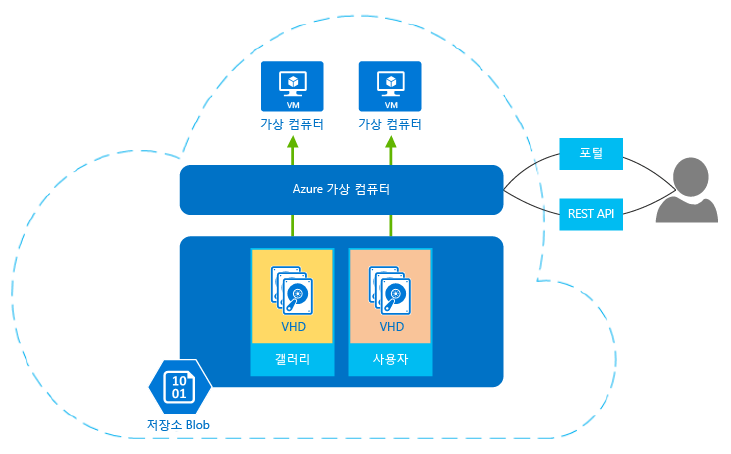

## 가상 컴퓨터에 대한 정보
Azure 가상 컴퓨터를 사용하여 클라우드에서 가상 컴퓨터를 만들고 사용할 수 있습니다. *IaaS(Infrastructure as a Service)*라는 가상 컴퓨터 기술을 통해 다양한 방법으로 사용될 수 있습니다. 일부 사례:

* **개발 및 테스트용 VM(가상 컴퓨터).** 일반적으로 개발 그룹은 코드에 필요한 특정 구성을 가진 컴퓨터를 만들고 응용 프로그램을 테스트할 쉽고 빠른 방법을 제공하기 때문에 VM을 사용합니다. Azure 가상 컴퓨터는 이러한 VM을 만들고 사용한 다음 더 이상 필요 없을 때 삭제하기 위해 간단하고 경제적인 방법을 제공합니다.
* **클라우드에서 응용 프로그램 실행.** 일부 응용 프로그램의 경우 공용 클라우드에서 실행하면 경제적입니다. 한 가지 예는 스파이크 수요가 많은 응용 프로그램입니다. 최대 수요를 처리하기 위한 충분한 하드웨어와 함께 사용자 고유의 데이터센터를 갖출 수 있다고 해도 상당한 시간 동안 해당 하드웨어를 활용하지 못할 수 있습니다. Azure에서 이 응용 프로그램을 실행하면 추가 VM이 필요할 때만 사용 요금을 지불할 수 있으며 필요하지 않을 때에는 사용을 종료할 수 있습니다. 또는 주문형 컴퓨팅 리소스가 무약정으로 급히 필요한 신규업체라고 가정합니다. Azure는 올바른 선택이 될 수 있습니다.
* **공용 클라우드로 데이터센터 확장.** Azure 가상 네트워크를 사용하면 조직에서는 고유한 온-프레미스 네트워크의 확장인 VNET(가상 네트워크)을 만들 수 있으며 해당 VNET에 VM을 추가할 수 있습니다. [SharePoint](../articles/virtual-machines/windows/sharepoint-farm.md?toc=%2fazure%2fvirtual-machines%2fwindows%2ftoc.json), [SQL Server](../articles/virtual-machines/windows/sql/virtual-machines-windows-sql-server-iaas-overview.md) 및 Azure VM상의 기타 응용 프로그램과 같은 응용 프로그램을 실행할 수 있습니다. 이 방법을 통해 사용자 고유의 데이터센터에서 실행하는 것보다 더 쉽게 배포하거나 더 저렴하게 이용할 수 있습니다.   
* **재해 복구.** 거의 사용되지 않는 백업 데이터 센터에 대해 지속적으로 지불하는 것보다 IaaS 기반 재해 복구를 사용하면 필요한 경우에만 필요한 컴퓨팅 리소스에 대해 지불할 수 있습니다.  예를 들어 기본 데이터 센터가 작동 중단되면 Azure에서 실행되는 VM을 만들어 필수 응용 프로그램을 실행한 다음 더 이상 필요 없을 때 종료할 수 있습니다.

다른 가상 컴퓨터와 같이 Azure의 VM에도 운영 체제, 저장소 및 네트워킹 기능이 있으며 다양한 응용 프로그램을 실행할 수 있습니다. Azure 또는 파트너 중 하나에서 제공하는 이미지를 사용하거나 자신만의 이미지를 사용할 수 있습니다. 그 예로는 다음과 같은 다양한 버전 및 구성이 있습니다.

* Suse, Ubuntu 및 CentOS와 같은 Linux 서버
* Windows Server 
* SQL Server
* BizTalk Server 
* SharePoint Server

가상 컴퓨터는 VHD(가상 하드 디스크)를 사용하여 해당 OS(운영 체제) 및 데이터를 저장합니다. VHD는 OS를 설치하도록 선택할 수 있는 이미지에도 사용됩니다. 다음 그림은 이뿐 아니라 VM 만들기 및 관리를 위한 두 가지 도구도 보여 줍니다.

**그림: Azure 가상 컴퓨터는 IaaS(Infrastructure as a Service)를 제공합니다.**

VM은 스크립팅 지원을 통해 브라우저 기반 포털, 명령줄 도구를 사용하거나 또는 REST API를 통해 직접적으로 관리할 수 있습니다. 또한 RightScale 및 ScaleXtreme과 같은 Microsoft 파트너도 REST API를 사용하는 관리 서비스를 제공합니다. 

운영 체제와 함께 다음을 포함하는 VM으로 기타 구성을 선택할 수 있습니다.

* 연결할 수 있는 디스크 수 및 처리 능력과 같은 요소를 결정하는 크기. Azure는 다양한 크기를 제공하여 다양한 유형의 사용을 지원합니다. 자세한 내용은 [가상 컴퓨터의 크기](../articles/virtual-machines/linux/sizes.md?toc=%2fazure%2fvirtual-machines%2flinux%2ftoc.json)를 참조하세요.  
* 미국, 유럽 또는 아시아와 같이 새 VM이 호스팅되는 Azure 지역. 
* Windows PowerShell의 필요한 상태 구성 기능 사용 또는 바이러스 백신 실행과 같은 가상 컴퓨터의 추가 기능을 제공하는 VM 확장 프로그램.

VM에 대해 고려할 기타 혜택은 다음과 같습니다.

**종량제** -- Azure는 VM의 크기와 운영 체제에 기반한 시간당 가격을 청구합니다. 부분 시간의 경우 Azure는 사용 시간(분)에 대해서만 청구합니다. 저장소는 가격이 책정되며 개별적으로 청구됩니다. 자세한 내용은 [가상 컴퓨터 가격](https://azure.microsoft.com/pricing/details/virtual-machines/)을 참조하세요.

**복원력** -- Azure는 실행 중인 각 VM을 호스팅하는 실제 하드웨어를 모니터링 합니다. VM을 실행하는 실제 서버에 오류가 생기는 경우, Azure가 이를 공지하며 VM을 새 하드웨어로 옮기고 VM을 다시 시작합니다. 이 프로세스는 서비스 복구라고도 합니다. 또한 Azure는 Blob 저장소에 VHD의 중복 복사본을 유지하여 가상 컴퓨터의 데이터를 보호합니다. 

