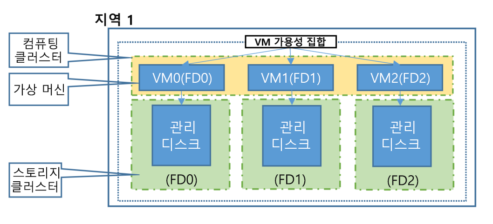

# Azure에서 가상 머신의 지역 및 가용성
Azure는 전 세계 여러 데이터 센터에서 작동합니다. 이러한 데이터 센터는 지리적 영역으로 그룹화되므로 애플리케이션을 빌드할 위치를 유연하게 선택할 수 있습니다. 성능, 가용성 및 중복성을 최대화하는 옵션을 함께 Azure에서 VMs(가상 머신)가 작동하는 위치와 방법을 이해하는 것이 중요합니다. 이 문서에서는 Azure의 가용성 및 중복성 기능에 대 한 개요를 제공합니다.

## Azure 지역이란?
'미국 서부', '북유럽' 또는 '동남 아시아'와 같이 정의된 지역에 Azure 리소스를 만듭니다. [지역 및 위치 목록](https://azure.microsoft.com/regions/)을 검토할 수 있습니다. 각 지역 내에는 중복성 및 가용성을 제공하기 위한 여러 데이터 센터가 존재합니다. 이 방법은 사용자에게 가장 가까운 VM을 만들고 법률, 규정 준수 또는 세금 목적을 충족할 수 있도록 애플리케이션을 설계할 때 유연성을 제공합니다.

## 특수 Azure 지역
Azure에는 규정 준수 또는 법적 목적에 맞게 애플리케이션을 빌드할 때 사용할 수 있는 특별한 Azure 지역이 있습니다. 이 특수 지역에는 다음이 포함됩니다.

* **미국 버지니아 주 정부** 및 **미국 아이오와 주 정부**
  * 미국 정부 기관 및 파트너를 위한 물리적 및 논리적 네트워크로 격리된 Azure 인스턴스로, 선별된 미국인이 운영합니다. [FedRAMP](https://www.microsoft.com/en-us/TrustCenter/Compliance/FedRAMP) 및 [DISA](https://www.microsoft.com/en-us/TrustCenter/Compliance/DISA)와 같은 추가 규정 준수 인증서를 포함합니다. [Azure Government](https://azure.microsoft.com/features/gov/)에 대해 자세히 알아보세요.
* **중국 동부** 및 **중국 북부**
  * 이러한 지역은 Microsoft 및 21Vianet 간의 고유한 파트너십을 통해 사용할 수 있으며, Microsoft에서 데이터 센터를 직접 관리하지 않습니다. [중국의 Microsoft Azure](http://www.windowsazure.cn/)에 대해 자세히 알아보세요.
* **독일 중부** 및 **독일 북동부**
  * 이러한 지역은 데이터 트러스티 모델을 통해 사용할 수 있으며, 이로 인해 독일 데이터 트러스티 역할을 수행하는 독일 통신국 회사인 T-Systems의 관리 하에 고객 데이터가 독일에서 유지됩니다.

## 지역 쌍
각 Azure 지역은 동일한 지리적 위치 내의 다른 지역(예: 미국, 유럽 또는 아시아)과 쌍을 이룹니다. 이 방법을 통해 지역에서 VM 저장소와 같은 리소스를 복제하여 자연 재해, 내전, 정전 또는 물리적 네트워크 중단이 두 지역 모두에 영향을 미칠 가능성을 줄일 수 있습니다. 지역 쌍에 대한 추가적인 이점은 다음과 같습니다.

* 좀 더 광범위한 Azure 중단 시, 모든 쌍 중에서 한 지역에 더 높은 우선 순위를 두어 애플리케이션 복원 시간을 단축할 수 있습니다. 
* 계획된 Azure 업데이트는 가동 중지 및 애플리케이션 중단 위험을 최소화하기 위해 한 번에 한 쌍의 지역으로 롤아웃됩니다.
* 데이터는 세금 및 법률 집행 관할 구역에 사용될 수 있게 동일한 지리적 위치 내에 쌍으로(브라질 남부 제외) 상주합니다.

지역 쌍 예제는 다음과 같습니다.

| 보조 | 주 |
|:--- |:--- |
| 미국 서부 |미국 동부 |
| 유럽 북부 |서유럽 |
| 동남아시아 |동아시아 |

[여기에서 전체 지역 쌍 목록](../articles/best-practices-availability-paired-regions.md#what-are-paired-regions)을 확인할 수 있습니다.

## 기능 가용성
일부 서비스 또는 VM 기능(예: 특정 VM 크기 또는 저장소 형식)은 특정 지역에서만 사용할 수 있습니다. [Azure Active Directory](../articles/active-directory/fundamentals/active-directory-whatis.md), [Traffic Manager](../articles/traffic-manager/traffic-manager-overview.md) 또는 [Azure DNS](../articles/dns/dns-overview.md)와 같이 특정 지역을 선택하지 않아도 되는 전역 Azure 서비스도 있습니다. 애플리케이션 환경 설계에 도움이 되도록 [각 지역의 Azure 서비스 가용성](https://azure.microsoft.com/regions/#services)을 확인할 수 있습니다. [각 지역에서 지원되는 VM 크기 및 제한을 프로그래밍 방식으로 쿼리](../articles/azure-resource-manager/resource-manager-sku-not-available-errors.md)할 수도 있습니다.

## 저장소 가용성
사용 가능한 저장소 복제 옵션을 고려할 때 Azure 지역 및 지리적 위치를 이해하는 것이 중요합니다. 저장소 형식에 따라 여러 복제 옵션이 있습니다.

**Azure Managed Disks**
* LRS(로컬 중복 저장소)
  * 저장소 계정을 만든 지역 내에서 데이터를 3번 복제합니다.

**Storage 계정 기반 디스크**
* LRS(로컬 중복 저장소)
  * 저장소 계정을 만든 지역 내에서 데이터를 3번 복제합니다.
* ZRS(영역 중복 저장소)
  * 단일 지역 내에서 또는 2개 지역에 걸쳐 2~3개 시설에서 데이터를 3번 복제합니다.
* GRS(지역 중복 저장소)
  * 기본 지역에서 수백 마일 떨어져 있는 보조 영역에 데이터를 복제합니다.
* RA-GRS(읽기 액세스 지역 중복 저장소)
  * GRS를 사용할 경우와 마찬가지로 보조 지역에 데이터를 복제하지만 보조 위치의 데이터에 대해 읽기 전용 액세스를 제공합니다.

다음 테이블에서는 저장소 복제 형식 간 차이점을 간략히 요약해서 보여 줍니다.

| 복제 전략 | LRS | ZRS | GRS | RA-GRS |
|:--- |:--- |:--- |:--- |:--- |
| 데이터가 여러 시설에 걸쳐 복제됩니다. |아닙니다. |예 |예 |예 |
| 기본 위치와 보조 위치에서 데이터를 읽을 수 있습니다. |아닙니다. |아니요 |아니요 |예 |
| 별도 노드에서 유지 관리되는 데이터 복사본 수입니다. |3 |3 |6 |6 |

[여기에서 Azure Storage 복제 옵션](../articles/storage/common/storage-redundancy.md)에 대해 자세히 알아볼 수 있습니다. 관리 디스크에 대한 자세한 내용은 [Azure Managed Disks 개요](../articles/virtual-machines/windows/managed-disks-overview.md)를 참조하세요.

### 저장소 비용
가격은 선택한 저장소 형식 및 가용성에 따라 달라집니다.

**Azure Managed Disks**
* 프리미엄 Managed Disks는 SSD(반도체 드라이브)로 지원되며, 표준 Managed Disks는 일반 회전 디스크로 지원됩니다. 프리미엄 및 표준 Managed Disks는 모두 디스크에 프로비전된 용량에 따라 요금이 청구됩니다.

**관리되지 않는 디스크**
* Premium Storage는 SSD(반도체 드라이브)로 지원되며, 디스크 용량에 따라 요금이 청구됩니다.
* 표준 저장소는 일반적인 회전 디스크로 지원되며, 사용 중인 용량 및 원하는 저장소 가용성을 기준으로 요금이 청구됩니다.
  * RA-GRS의 경우 해당 데이터를 또 다른 Azure 지역에 복제하는 대역폭에 대해 추가적인 지역 복제 데이터 전송 비용이 부과됩니다.

다양한 스토리지 형식 및 가용성에 대한 가격 책정 정보를 보려면 [Azure Storage 가격 책정](https://azure.microsoft.com/pricing/details/storage/) 을 참조하세요.

## 가용성 집합
가용성 세트은 중복성과 가용성을 제공하기 위해 Azure에서 애플리케이션이 빌드되는 방식을 이해할 수 있도록 하는 데이터 센터에 있는 VM의 논리적 그룹입니다. 고가용성 애플리케이션을 제공하고 [99.95% Azure SLA](https://azure.microsoft.com/support/legal/sla/virtual-machines/)를 충족할 수 있도록 가용성 집합 내에 둘 이상의 VM을 만드는 것이 좋습니다. 가용성 집합 자체에 대한 비용은 없으므로 만드는 각 VM 인스턴스에 대해서만 요금을 지불합니다. 단일 VM이 [Azure 프리미엄 SSD](../articles/virtual-machines/windows/disks-types.md#premium-ssd)를 사용하는 경우, 계획되지 않은 유지 관리 이벤트에 대해 Azure SLA가 적용됩니다.

가용성 집합은 하드웨어 오류를 방지하고 업데이트를 안전하게 적용할 수 있도록 하는 두 가지 추가 그룹, 즉 FD(장애 도메인)와 UD(업데이트 도메인)로 구성됩니다. [Linux VM](../articles/virtual-machines/linux/manage-availability.md) 또는 [Windows VM](../articles/virtual-machines/windows/manage-availability.md)의 가용성을 관리하는 방법에 대한 자세한 내용을 확인하세요.

### 장애 도메인
장애 도메인은 온-프레미스 데이터 센터 내의 랙과 비슷하게 공통 전원 및 네트워크 스위치를 공유하는 기본 하드웨어의 논리적 그룹입니다. 가용성 집합 내에서 VM을 만들 때 Azure 플랫폼에서는 이러한 오류 도메인에 걸쳐 VM을 자동으로 분산합니다. 이 방법은 잠재적인 물리적 하드웨어 오류, 네트워크 중단 또는 전원 중단의 영향을 제한합니다.

### 업데이트 도메인
업데이트 도메인은 동시에 유지 관리를 진행하거나 다시 부팅될 수 있는 기본 하드웨어의 논리적 그룹입니다. 가용성 집합 내에서 VM을 만들 때 Azure 플랫폼에서는 이러한 업데이트 도메인에 걸쳐 VM을 자동으로 분산합니다. 이 방법을 통해 Azure 플랫폼이 정기적으로 유지 관리를 거치는 동안 애플리케이션에 있는 하나 이상의 인스턴스가 항상 실행됩니다. 재부팅되는 업데이트 도메인의 순서는 계획된 유지 보수 중 순차적으로 진행할 수 없으며 한 번에 하나의 업데이트 도메인만이 재부팅됩니다.

### 관리 디스크 장애 도메인
[Azure Managed Disks](../articles/virtual-machines/windows/faq-for-disks.md)를 사용하는 VM의 경우, 관리 가용성 집합을 사용할 때 VM은 관리 디스크 장애 도메인에 맞춰집니다. 이러한 정렬은 VM에 연결된 모든 관리 디스크가 동일한 관리 디스크 장애 도메인 내에 있도록 합니다. 관리 디스크의 VM만 관리 가용성 집합에서 만들어질 수 있습니다. 관리 디스크 장애 도메인의 수는 지역에 따라 다릅니다. 즉, 지역당 2개 또는 3개의 관리 디스크 장애 도메인이 있을 수 있습니다. 이러한 [Linux VM](../articles/virtual-machines/linux/manage-availability.md?#use-managed-disks-for-vms-in-an-availability-set) 또는 [Windows VM](../articles/virtual-machines/windows/manage-availability.md?#use-managed-disks-for-vms-in-an-availability-set)용 관리 디스크 장애 도메인에 대한 자세한 내용을 참조할 수 있습니다.

## 가용성 영역

[가용성 영역](../articles/availability-zones/az-overview.md)은 가용성 집합의 대안으로써 VM에 있는 애플리케이션 및 데이터의 가용성을 유지해야 하는 컨트롤 수준을 확장합니다. 가용성 영역은 Azure 지역 내에서 물리적으로 별도 영역입니다. 지원되는 Azure 지역당 3개의 가용성 영역이 있습니다. 각 가용성 영역에는 고유한 소스, 네트워크 및 냉각 장치가 있습니다. 영역에 복제된 VM을 사용하는 솔루션을 설계하여 데이터 센터 손실로부터 앱과 데이터를 보호할 수 있습니다. 하나의 영역이 손상되면 다른 영역에서 복제된 앱 및 데이터를 즉시 사용할 수 있습니다. 

가용성 영역에서 [Windows](../articles/virtual-machines/windows/create-powershell-availability-zone.md) 또는 [Linux](../articles/virtual-machines/linux/create-cli-availability-zone.md) VM을 배포하는 방법에 대해 자세히 알아봅니다.

## 다음 단계
이제 이러한 가용성 및 중복 기능을 사용하여 Azure 환경을 빌드하기 시작할 수 있습니다. 모범 사례 정보는 [Azure 가용성 모범 사례](../articles/best-practices-availability-checklist.md)를 참조하세요.

