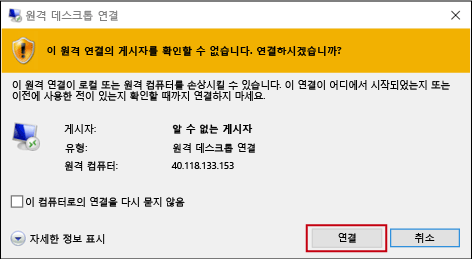
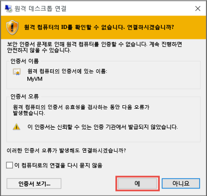

1. 가상 머신 속성 페이지에서 **연결** 단추를 클릭합니다. 
2. **가상 머신에 연결** 페이지에서 적절한 옵션을 선택하고 **RDP 파일 다운로드**를 클릭합니다.
2. 다운로드한 RDP 파일을 열고 메시지가 표시되면 **연결**을 클릭합니다. 
2. `.rdp` 파일이 알 수 없는 게시자에게서 비롯되었다는 경고를 받게 됩니다. 이것은 정상입니다. 원격 데스크톱 창에서 **연결** 을 클릭하여 계속합니다.

    
3. **Windows 보안** 창에서 **추가 선택 사항** 및 **다른 계정 사용**을 차례로 선택합니다. 가상 머신의 계정에 대한 자격 증명을 입력하고 **확인**을 클릭합니다.

     **로컬 계정** - 일반적으로 가상 머신을 만들 때 지정한 로컬 계정 사용자 이름 및 암호입니다. 이 경우 도메인은 가상 머신의 이름이므로 *vmname*&#92;*username*으로 입력합니다.  

    **도메인 가입 VM** - VM이 도메인에 속하는 경우, *도메인*&#92;*사용자 이름* 형식으로 사용자 이름을 입력합니다. 또한 계정은 관리자 그룹에 있거나 VM에 대한 원격 액세스 권한을 부여 받아야 합니다.

    **도메인 컨트롤러** - VM이 도메인 컨트롤러인 경우 해당 도메인의 도메인 관리자의 사용자 이름과 암호를 입력합니다.
4. **예** 를 클릭하여 가상 머신의 ID를 확인하고 로그온을 완료합니다.

   
