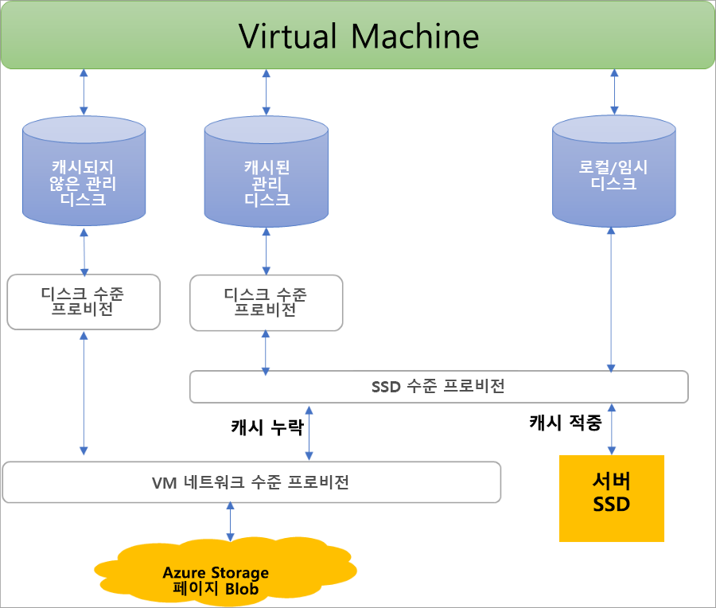

## 관리 디스크의 이점

관리 디스크를 사용하여 얻을 수 있는 몇 가지 이점에 대해 살펴보겠습니다.

### 뛰어난 내구성 및 가용성

관리 디스크는 99.999%의 가용성을 위해 설계되었습니다. 관리 디스크는 높은 내구성을 위한 세 개의 데이터 복제본을 제공하여 이러한 가용성을 달성합니다. 즉, 하나 또는 두 개의 복제본에서 문제가 발생하는 경우 나머지 복제본을 사용하면 데이터의 지속성과 우수한 내결함성을 확보할 수 있습니다. 이러한 아키텍처를 통해 Azure는 IaaS(Infrastructure as a Service) 디스크에 엔터프라이즈급 내구성을 지속적으로 제공할 뿐만 아니라 연간 실패율 0%로 업계 최고를 자랑합니다.

### 간단하고 확장성 있는 VM 배포

관리 디스크를 사용하면 지역당 구독에 특정 유형의 VM **디스크**를 50,000개까지 만들 수 있고 따라서 단일 구독에 수천 개의 **VM**을 만들 수 있습니다. 이 기능을 사용하면 Marketplace 이미지를 사용하여 가상 머신 확장 집합에 VM을 1,000개까지 만들 수 있기 때문에 [가상 머신 확장 집합](../articles/virtual-machine-scale-sets/virtual-machine-scale-sets-overview.md)의 확장성을 훨씬 더 높일 수도 있습니다.

### 가용성 집합과 통합

관리 디스크는 가용성 집합과 통합되어 단일 실패 지점을 피할 만큼 [가용성 집합의 VM](../articles/virtual-machines/windows/manage-availability.md#use-managed-disks-for-vms-in-an-availability-set) 디스크가 서로 충분히 격리되도록 해줍니다. 디스크는 다른 스토리지 배율 단위(스탬프)에 자동으로 배치됩니다. 스탬프가 하드웨어 또는 소프트웨어 오류로 인해 실패하는 경우 해당 스탬프의 디스크가 있는 VM 인스턴스만 실패합니다. 예를 들어 애플리케이션을 5개의 VM에서 실행 중이고 VM이 가용성 집합 내에 있다고 가정해 보겠습니다. 이러한 VM의 디스크는 동일한 스탬프에 저장되지 않습니다. 따라서 스탬프 하나가 작동이 중단되면 다른 애플리케이션 인스턴스가 계속해서 실행됩니다.

### 가용성 영역과 통합

관리 디스크는 [가용성 영역](../articles/availability-zones/az-overview.md)을 지원합니다. 이는 데이터 센터 오류로부터 애플리케이션을 보호하는 고가용성 기능입니다. 가용성 영역은 Azure 지역 내의 고유한 물리적 위치입니다. 각 영역은 독립된 전원, 냉각 및 네트워킹을 갖춘 하나 이상의 데이터 센터로 구성됩니다. 복원력을 보장하려면 활성화된 모든 지역에서 최소한 세 개의 별도 영역이 필요합니다. Azure는 가용성 영역을 통해 업계 최고의 99.99% VM 작동 시간 SLA를 제공합니다.

### Azure Backup 지원

지역적 재해로부터 보호하기 위해 시간 기반 백업 및 백업 보존 정책에 따라 백업 작업을 만드는 데 [Azure Backup](../articles/backup/backup-overview.md)을 사용할 수 있습니다. 이를 통해 VM 복원을 원하는 대로 쉽게 수행할 수 있습니다. 현재, Azure Backup은 최대 4TiB(테비바이트)의 디스크 크기를 지원합니다.  Azure Backup은 관리 디스크의 백업 및 복원을 지원합니다. Azure VM 백업 지원에 대해 [자세히 알아보세요](../articles/backup/backup-support-matrix-iaas.md).

### 세부적인 액세스 제어

[Azure RBAC(역할 기반 액세스 제어)](../articles/role-based-access-control/overview.md)를 사용하여 관리 디스크에 대한 특정 권한을 한 명 이상의 사용자에게 할당할 수 있습니다. 관리 디스크는 읽기, 쓰기(만들기/업데이트), 삭제, [SAS(공유 액세스 서명) URI](../articles/storage/common/storage-dotnet-shared-access-signature-part-1.md) 검색 등 디스크에 대한 다양한 작업을 공개합니다. 업무를 수행하는 데 필요한 작업에만 액세스 권한을 부여할 수 있습니다. 예를 들어 관리 디스크를 스토리지 계정에 복사하지 말아야 하는 경우에는 해당 관리 디스크에 대한 내보내기 작업에 액세스를 부여하지 않도록 선택할 수 있습니다. SAS URI를 사용하여 관리 디스크를 복사할 수 없도록 하기 위해 관리 디스크에 해당 권한을 부여하지 않도록 선택할 수 있습니다.

### vhd 업로드

 직접 업로드를 사용하면 vhd를 Azure 관리 디스크로 쉽게 전송할 수 있습니다. 이전에는 스토리지 계정에 데이터 준비를 포함하는 더 많은 관련 프로세스를 수행해야 했습니다. 이제 단계가 줄어듭니다. Azure에 온-프레미스 VM을 업로드하거나 대규모 관리 디스크에 업로드하는 과정에서 번거로움이 줄어듭니다. 백업 및 복원 프로세스도 간단해집니다. 또한 데이터를 VM에 연결하지 않고도 관리 디스크에 직접 업로드할 수 있으므로 비용이 절감됩니다. 직접 업로드를 사용하여 최대 32TiB 크기의 vhd를 업로드할 수 있습니다.

 vhd를 Azure로 전송하는 방법을 알아보려면 [CLI](../articles/virtual-machines/linux/disks-upload-vhd-to-managed-disk-cli.md) 또는 [PowerShell](../articles/virtual-machines/windows/disks-upload-vhd-to-managed-disk-powershell.md) 문서를 참조하세요.

## 암호화

관리 디스크는 두 가지 종류의 암호화를 제공합니다. 첫 번째는 스토리지 서비스에서 수행하는 SSE(서버 쪽 암호화)이고, 두 번째는 VM에 대한 OS 및 데이터 디스크에서 사용할 수 있는 ADE(Azure Disk Encryption)입니다.

### 서버 쪽 암호화

[Azure 서버 쪽 암호화](../articles/virtual-machines/windows/disk-encryption.md)는 저장 데이터 암호화를 제공하고, 조직의 보안 및 규정 준수 약정에 맞게 데이터를 보호합니다. 서버 쪽 암호화는 관리 디스크를 사용할 수 있는 모든 지역의 모든 관리 디스크, 스냅샷 및 이미지에서 기본적으로 사용하도록 설정됩니다. Azure에서 키를 관리하도록 허용하거나 플랫폼 관리 키, 직접 키를 관리할 수 있습니다. 이러한 키는 고객 관리 키입니다. 자세한 내용은 [Managed Disks FAQ 페이지](../articles/virtual-machines/windows/faq-for-disks.md#managed-disks-and-storage-service-encryption)를 참조하세요.

### Azure 디스크 암호화

Azure Disk Encryption을 사용하면 IaaS Virtual Machines에서 사용되는 OS 및 데이터 디스크를 암호화할 수 있습니다. 이 암호화에는 관리되는 디스크가 포함됩니다. Windows의 경우 업계 표준의 BitLocker 암호화 기술을 사용하여 드라이브가 암호화됩니다. Linux의 경우 DM-Crypt 기술을 사용하여 디스크가 암호화됩니다. 이 암호화 프로세스는 Azure Key Vault와 통합되어 디스크 암호화 키를 제어 및 관리할 수 있도록 합니다. 자세한 내용은 [IaaS VM용 Azure Disk Encryption](../articles/security/azure-security-disk-encryption-overview.md)을 참조하세요.

## 디스크 역할

Azure에는 데이터 디스크, OS 디스크 및 임시 디스크라는 3가지 주요 디스크 역할이 있습니다. 이러한 역할은 가상 머신에 연결된 디스크에 매핑됩니다.

### 데이터 디스크

데이터 디스크는 애플리케이션 데이터 또는 사용자가 보존해야 하는 기타 데이터를 저장하기 위해 가상 머신에 연결된 관리 디스크입니다. 데이터 디스크는 SCSI 드라이브로 등록되며 사용자가 선택한 문자로 레이블이 지정됩니다. 각 데이터 디스크의 최대 용량은 32,767GiB(기비바이트)입니다. 가상 머신의 크기에 따라 사용자가 해당 가상 머신에 연결할 수 있는 데이터의 디스크의 용량과 디스크를 호스트하기 위해 사용할 수 있는 스토리지 유형이 결정됩니다.

### OS 디스크

모든 가상 머신은 하나의 연결된 운영 체제 디스크를 갖습니다. OS 디스크에는 VM이 만들어질 때 선택된 OS가 사전 설치되어 있습니다. 이 디스크에는 부팅 볼륨이 포함되어 있습니다.

이 디스크의 최대 용량은 2,048GiB입니다.

### 임시 디스크

모든 VM 디스크는 관리 디스크가 아닌 임시 디스크를 포함합니다. 이러한 임시 디스크는 애플리케이션 및 프로세스에 대한 단기 스토리지를 제공하며 페이지 또는 스왑 파일과 같은 데이터 저장에 사용됩니다. 임시 디스크의 데이터는 [유지 관리 이벤트](../articles/virtual-machines/windows/manage-availability.md?toc=%2fazure%2fvirtual-machines%2fwindows%2ftoc.json#understand-vm-reboots---maintenance-vs-downtime) 기간에 또는 [VM을 다시 배포](../articles/virtual-machines/troubleshooting/redeploy-to-new-node-windows.md?toc=%2Fazure%2Fvirtual-machines%2Fwindows%2Ftoc.json)할 때 손실될 수 있습니다. Azure Linux VM의 임시 디스크는 기본적으로 /dev/sdb이고, Windows VM의 임시 디스크는 기본적으로 D:입니다. VM을 정상적으로 재부팅하는 동안 임시 디스크의 데이터는 유지됩니다.

## 관리 디스크 스냅샷

관리 디스크 스냅샷은 기본적으로 표준 관리 디스크로 저장되는 관리 디스크의 읽기 전용 크래시 일치 전체 복사본입니다. 스냅샷을 사용하면 관리 디스크를 언제든지 백업할 수 있습니다. 이 스냅샷은 원본 디스크와 별도로 존재하고 새 관리 디스크를 만드는 데 사용될 수도 있습니다. 

사용된 크기에 따라 스냅샷 요금이 청구됩니다. 예를 들어 프로비저닝된 용량이 64GiB이고 실제 사용된 데이터 크기가 10GiB인 관리 디스크의 스냅샷을 만들면 사용된 10GiB의 데이터 크기에 대해서만 스냅샷 요금이 청구됩니다. [Azure 사용량 보고서](https://docs.microsoft.com/azure/billing/billing-understand-your-bill)를 보면 사용된 스냅샷의 크기를 확인할 수 있습니다. 예를 들어 스냅샷의 사용된 데이터 크기가 10GiB이면 **일별** 사용량 보고서에 10GiB/(31일) = 0.3226GiB가 소비량으로 표시됩니다.

관리 디스크를 사용하여 스냅샷을 만드는 방법에 대해 자세히 알아보려면 다음 리소스를 참조하세요.

* [Windows에서 Managed Disk의 스냅샷 만들기](../articles/virtual-machines/windows/snapshot-copy-managed-disk.md)
* [Linux에서 Managed Disk의 스냅샷 만들기](../articles/virtual-machines/linux/snapshot-copy-managed-disk.md)

### 이미지

관리 디스크는 관리되는 사용자 지정 이미지 만들기도 지원합니다. 스토리지 계정의 사용자 지정 VHD에서 이미지를 만들거나 일반화된(시스템에서 준비된) VM에서 직접 만들 수 있습니다. 이 프로세스는 단일 이미지를 캡처합니다. 이 이미지는 OS와 데이터 디스크를 모두 포함하여 VM과 연결된 모든 관리 디스크를 포함합니다. 이 관리되는 사용자 지정 이미지를 사용하면 스토리지 계정을 복사하거나 관리할 필요 없이 사용자 지정 이미지를 사용하여 수백 개의 VM을 만들 수 있습니다.

이미지 만들기에 대한 내용은 다음 문서를 참조하세요.

* [Azure에서 일반화된 VM의 관리 이미지를 캡처하는 방법](../articles/virtual-machines/windows/capture-image-resource.md)
* [Azure CLI를 사용하여 Linux 가상 머신을 일반화하고 캡처하는 방법](../articles/virtual-machines/linux/capture-image.md)

#### 이미지 및 스냅샷

이미지와 스냅샷의 차이를 이해하는 것이 중요합니다. 관리 디스크를 사용하면 할당이 취소되어 일반화된 VM의 이미지를 만들 수 있습니다. 이 이미지에는 VM에 연결된 모든 디스크가 포함됩니다. 이 이미지를 사용하여 VM을 만들 수 있고 여기에는 모든 디스크가 포함됩니다.

스냅샷은 스냅샷 생성 시점의 디스크 복사본입니다. 이것은 하나의 디스크에만 해당됩니다. VM의 디스크가 하나(OS 디스크)뿐인 경우 이 VM의 스냅샷 또는 이미지를 만들고 이 스냅샷 또는 이미지로부터 VM을 만들 수 있습니다.

스냅샷은 포함하는 디스크 이외의 어떠한 디스크도 인식하지 않습니다. 따라서 스트라이프 등의 여러 디스크를 조정해야 하는 시나리오에서 사용하는 경우 문제가 될 수 있습니다. 스냅샷은 서로 조정할 수 있어야 하는데 현재는 지원되지 않습니다.

## 디스크 할당 및 성능

다음 다이어그램에서는 세 가지 수준의 프로비저닝 시스템을 사용하여 디스크에 대한 대역폭 및 IOPS의 실시간 할당을 보여 줍니다.

첫 번째 수준 프로비저닝에서는 디스크당 IOPS 및 대역폭 할당을 설정합니다.  두 번째 수준에서는 컴퓨팅 서버 호스트에서 SSD 프로비저닝을 구현하여 서버의 SSD에 저장된 데이터에만 이를 적용합니다. 여기에는 로컬 및 임시 디스크뿐만 아니라 캐싱(ReadWrite 및 ReadOnly)을 사용하는 디스크도 포함됩니다. 마지막으로, 세 번째 수준에서는 컴퓨팅 호스트에서 Azure Storage의 백 엔드로 보내는 I/O에 대한 VM 네트워크 프로비저닝이 수행됩니다. 이 체계를 사용하면 VM의 성능이 VM에서 로컬 SSD를 사용하는 방법에서 연결된 디스크 수, 연결된 디스크의 성능 및 캐싱 유형에 이르기까지 다양한 요인에 따라 달라집니다.

이러한 제한의 예로, Standard_DS1v1 VM은 캐시되는지 여부와 관계없이 SSD 및 네트워크 수준의 제한으로 인해 P30 디스크의 잠재적인 5,000IOPS를 달성할 수 없습니다.

Azure는 디스크 트래픽에 우선 순위가 지정된 네트워크 채널을 사용하므로 우선 순위가 다른 낮은 네트워크 트래픽보다 우선합니다. 이렇게 하면 네트워크 경합이 발생하는 경우 디스크에서 예상 성능을 유지할 수 있습니다. 마찬가지로 Azure Storage는 백그라운드에서 자동 부하 분산을 통해 리소스 경합 및 기타 문제를 처리합니다. Azure Storage는 디스크를 만들 때 필요한 리소스를 할당하고, 트래픽 수준을 처리하기 위해 리소스의 사전 예방 및 사후 대응 분산을 적용합니다. 이를 통해 디스크에서 예상 IOPS 및 처리량 목표를 유지할 수 있습니다. VM 수준 및 디스크 수준 메트릭을 사용하여 성능을 추적하고 필요에 따라 경고를 설정할 수 있습니다.

원하는 성능을 달성할 수 있도록 VM + 디스크 구성을 최적화하는 모범 사례를 알아보려면 [고성능을 위한 디자인](../articles/virtual-machines/windows/premium-storage-performance.md) 문서를 참조하세요.

## 다음 단계

관리 디스크에 대해 자세히 설명하는 비디오를 보려면 [Managed Disks를 통한 Azure VM 복원력 향상](https://channel9.msdn.com/Blogs/Azure/Managed-Disks-for-Azure-Resiliency)을 확인하세요.

Azure에서 제공하는 개별 디스크 유형 및 사용자의 요구 사항에 적합한 유형에 대해 자세히 알아보고, 디스크 유형 관련 문서에서 해당 성능 목표에 대해 알아봅니다.
