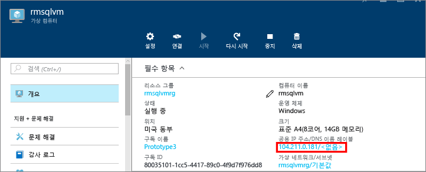
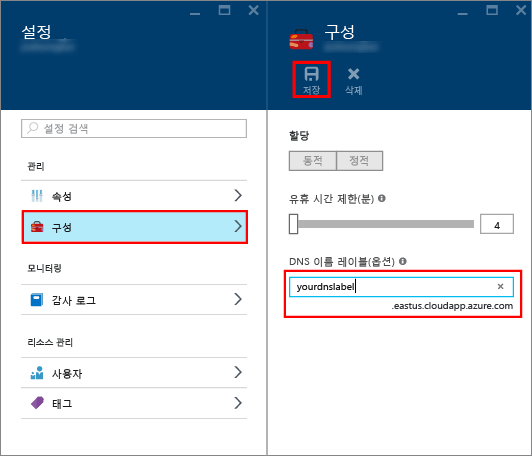
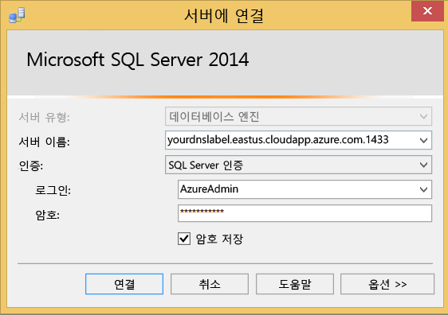

### 공용 IP 주소에 대한 DNS 레이블 구성

인터넷에서 SQL Server 데이터베이스 엔진에 연결하려면 공용 IP 주소에 대한 DNS 레이블을 만드는 것이 좋습니다. IP 주소로 연결할 수 있지만 DNS 레이블이 기본 공용 IP 주소를 쉽게 식별 및 추상화하는 A 레코드를 만듭니다.

> [!NOTE]
> 동일한 Virtual Network 내에서 또는 로컬로 SQL Server 인스턴스에 연결하려는 경우 DNS 레이블이 필요하지 않습니다.

DNS 레이블을 만들려면 먼저 포털에서 **가상 머신** 를 선택합니다. SQL Server VM을 선택하여 속성을 가져옵니다.

1. 가상 머신 개요에서 **공용 IP 주소**를 선택합니다.

    

1. 공용 IP 주소에 대한 속성에서 **구성**을 확장합니다.

1. DNS 레이블 이름을 입력합니다. 이 이름은 IP 주소로 직접 연결하는 대신 이름으로 SQL Server VM에 연결하는 데 사용할 수 있는 A 레코드입니다.

1. **저장** 단추를 클릭합니다.

    

### 다른 컴퓨터에서 데이터베이스 엔진에 연결

1. 인터넷에 연결된 컴퓨터에서 SSMS(SQL Server Management Studio)를 엽니다. SQL Server Management Studio가 없는 경우 [여기](https://docs.microsoft.com/sql/ssms/download-sql-server-management-studio-ssms)에서 다운로드할 수 있습니다.

1. **서버에 연결** 또는 **데이터베이스 엔진에 연결** 대화 상자에서 **서버 이름** 값을 편집합니다. 가상 머신의 IP 주소 또는 전체 DNS 이름을 입력합니다(이전 작업에서 확인). 쉼표를 추가하고 SQL Server의 TCP 포트를 제공할 수도 있습니다. 예: `mysqlvmlabel.eastus.cloudapp.azure.com,1433`

1. **인증** 상자에 **SQL Server 인증**을 선택합니다.

1. **로그인** 상자에 올바른 SQL 로그인 이름을 입력합니다.

1. **암호** 상자에 로그인 암호를 입력합니다.

1. **Connect**를 클릭합니다.

    