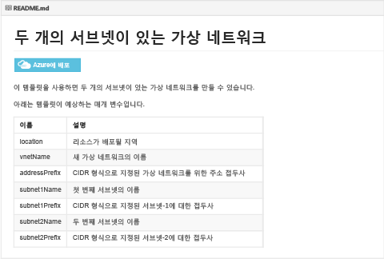
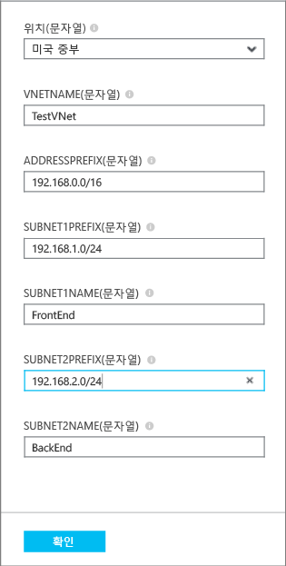
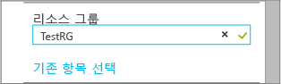

## 클릭하여 배포하는 방식으로 ARM 템플릿 배포

Microsoft에서 유지 관리하는 github 리포지토리에 대한 미리 정의된 ARM 템플릿 업로드를 다시 사용하고 해당 커뮤니티를 열 수 있습니다. 이러한 템플릿은 github에서 바로 배포하거나 다운로드한 후 필요에 맞게 수정할 수 있습니다. 두 서브넷으로 VNet을 만드는 템플릿을 배포하려면 다음 단계를 수행합니다.

1. 브라우저에서 [https://github.com/Azure/azure-quickstart-templates](https://github.com/Azure/azure-quickstart-templates)으로 이동합니다.
2. 템플릿 목록 아래로 스크롤하여 **101-vnet-two-subnets**를 클릭합니다. 아래와 같이 **README.md** 파일을 선택합니다.

	

3. **Deploy to Azure**를 클릭합니다. 필요한 경우 Azure 로그인 자격 증명을 입력합니다.
4. **매개 변수** 블레이드에서 새 VNet을 만드는 데 사용할 값을 입력하고 **확인**을 클릭합니다. 아래 그림은 이 시나리오에 대한 값을 보여 줍니다.

	

4. **리소스 그룹**을 클릭하고 VNet을 추가할 리소스 그룹을 클릭하거나 **새로 만들기**를 클릭하여 새 리소스 그룹에 VNet을 추가합니다. 리소스 그룹에 대해 자세히 알아보려면  항목을 참조하세요. 아래 그림은 **TestRG**라는 새 리소스 그룹에 대한 리소스 그룹 설정을 보여 줍니다.

	

5. 필요한 경우 VNet에 대한 **구독** 및 **위치** 설정을 변경합니다.
6. VNet을 **시작 보드**에 타일로 표시하지 않으려면 **시작 보드에 고정**을 사용하지 않도록 설정합니다.
5. **약관**을 클릭하고 약관을 읽은 후 **구입**을 클릭하여 동의합니다. 
6. **만들기**를 클릭하여 VNet을 만듭니다.

	

7. 배포가 완료되면 아래와 같이 **TestVNet** > **모든 설정** > **서브넷**을 클릭하여 서브넷 속성을 봅니다.

	

<!---HONumber=AcomDC_0211_2016-->