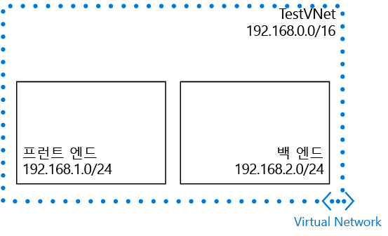

## 시나리오

VNet 및 서브넷을 만드는 방법을 설명하기 위해 이 문서에서는 다음 시나리오를 사용합니다.

이 시나리오에서는 예약된 CIDR 블록 **192.168.0.0./16**을 사용하여 **TestVNet**이라는 VNet을 만듭니다. VNet은 다음 서브넷을 포함합니다. 

* **FrontEnd**, CIDR 블록으로 **192.168.1.0/24** 사용
* **BackEnd**, CIDR 블록으로 **192.168.2.0/24** 사용