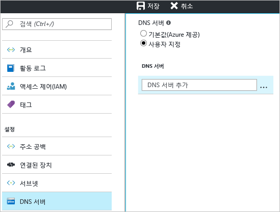

1. 가상 네트워크에 대한 **설정** 페이지에서 **DNS 서버**로 이동하고 클릭하여 DNS 서버 블레이드를 엽니다.
2. **DNS 서버** 페이지의 **DNS 서버**에서 **사용자 지정**을 선택합니다.
3. **DNS 서버** 필드의 **DNS 서버 추가** 상자에 이름 확인에 사용하려는 DNS 서버의 IP 주소를 입력합니다.
4. DNS 서버 추가를 완료했으면 블레이드의 맨 위에서 **저장**을 클릭하여 구성을 저장합니다.
   
    

