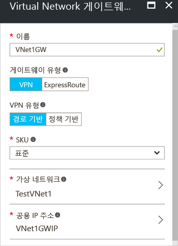

1. 포털 페이지의 왼쪽에서 **+**를 클릭하고 검색에서 '가상 네트워크 게이트웨이'를 입력합니다. **결과**에서 **가상 네트워크 게이트웨이**를 찾아 클릭합니다. **가상 네트워크 게이트웨이** 블레이드 하단에서 **만들기**를 클릭합니다. 그러면 **가상 네트워크 게이트웨이 만들기** 블레이드가 열립니다.
2. **가상 네트워크 게이트웨이 만들기** 블레이드에서 가상 네트워크 게이트웨이의 값을 채웁니다.

    
3. **이름**: 게이트웨이 이름을 지정합니다. 이는 게이트웨이 서브넷 이름 지정과 동일하지는 않습니다. 만드는 게이트웨이 개체의 이름입니다.
4. **게이트웨이 유형**: **VPN**을 선택합니다. VPN 게이트웨이는 가상 네트워크 게이트웨이 유형 **VPN**을 사용합니다. 
5. **VPN 유형**: 구성에 대해 지정된 VPN 유형을 선택합니다. 대부분의 구성에는 경로 기반 VPN 유형이 필요합니다.
6. **SKU**: 드롭다운에서 게이트웨이 SKU를 선택합니다. 드롭다운에 나열되는 SKU는 선택하는 VPN 유형에 따라 달라집니다.
7. **위치**: 위치를 보려면 스크롤해야 합니다. 가상 네트워크가 있는 위치를 가리키도록 **위치** 필드를 조정합니다. 위치에서 가상 네트워크가 있는 지역을 가리키고 있지 않으면 가상 네트워크가 다음 단계인 [가상 네트워크 선택] 드롭다운에 나타나지 않습니다.
8. **가상 네트워크**: 이 게이트웨이를 추가하려는 가상 네트워크를 선택합니다. **가상 네트워크**를 클릭하여 **가상 네트워크 선택** 블레이드를 엽니다. VNet을 선택합니다. VNet이 보이지 않으면 **위치** 필드가 가상 네트워크가 있는 지역을 가리키고 있는지 확인합니다.
9. **공용 IP 주소**: 이 블레이드는 공용 IP 주소를 동적으로 할당할 공용 IP 주소 개체를 만듭니다. **공용 IP 주소**를 클릭하여 **공용 IP 주소 선택** 블레이드를 엽니다. **+새로 만들기**를 클릭하여 **공용 IP 주소 만들기** 블레이드를 엽니다. 공용 IP 주소의 이름을 입력합니다. **확인**을 클릭하여 이 블레이드에 변경 내용을 저장합니다.

    
10. **구독**: 올바른 구독을 선택하는지 확인합니다.
11. **리소스 그룹**: 이 설정은 선택한 Virtual Network에 의해 결정됩니다. 
12. 앞의 설정을 지정한 후에는 **위치**를 조정하지 않습니다.
13. 설정을 확인합니다. 게이트웨이를 대시보드에 표시하려는 경우 블레이드의 맨 아래에서 **대시보드에 고정** 을 선택할 수 있습니다.
14. **만들기** 를 클릭하여 게이트웨이 만들기를 시작합니다. 설정을 확인하면 대시보드에 "가상 네트워크 게이트웨이 배포" 타일이 표시됩니다. 하나의 게이트웨이를 만드는 데 최대 45분이 걸릴 수 있습니다. 완료 상태를 확인하기 위해 포털 페이지를 새로 고쳐야 할 수 있습니다.
    
    
15. 게이트웨이를 만든 후 포털에서 가상 네트워크를 살펴보면 게이트웨이에 할당된 IP 주소를 볼 수 있습니다. 게이트웨이가 연결된 장치로 표시됩니다. 연결된 장치(가상 네트워크 게이트웨이)를 클릭하여 자세한 내용을 볼 수 있습니다.