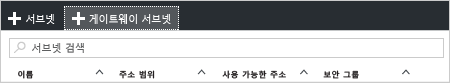

1. [포털](http://portal.azure.com)에서 가상 네트워크 게이트웨이를 만들려는 Resource Manager 가상 네트워크로 이동합니다.
2. VNet 블레이드의 **설정** 섹션에서 **서브넷**을 클릭하여 서브넷 블레이드를 확장합니다.
3. **서브넷** 블레이드에서 **+ 게이트웨이 서브넷**을 클릭하여 **서브넷 추가** 블레이드를 엽니다. 
   
    
4. 서브넷의 **이름**에 'GatewaySubnet' 값이 자동으로 채워집니다. Azure가 서브넷을 게이트웨이 서브넷으로 인식하기 위해 이 값이 필요합니다. 자동으로 채워진 **주소 범위** 값을 구성 요구 사항과 일치하도록 조정합니다.

    
5. 서브넷을 만들려면 블레이드 아래쪽에서 **확인**을 클릭합니다.

