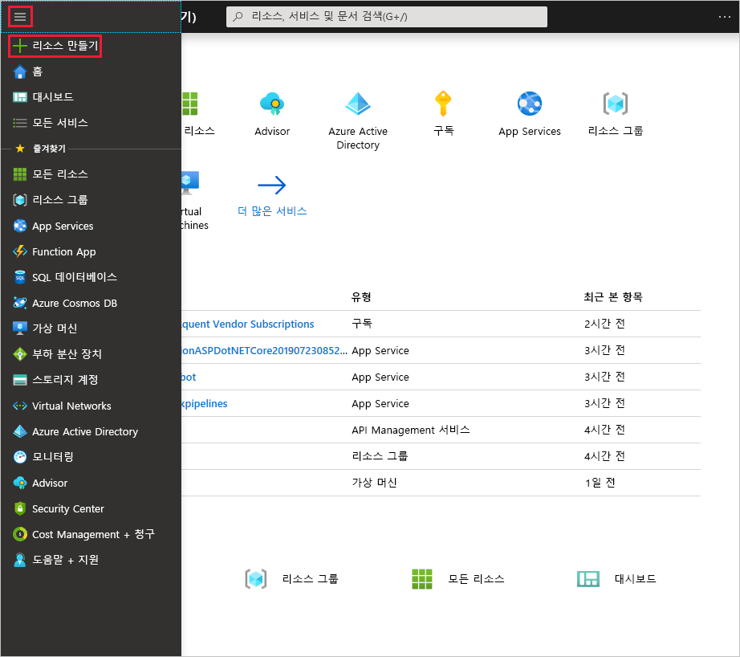
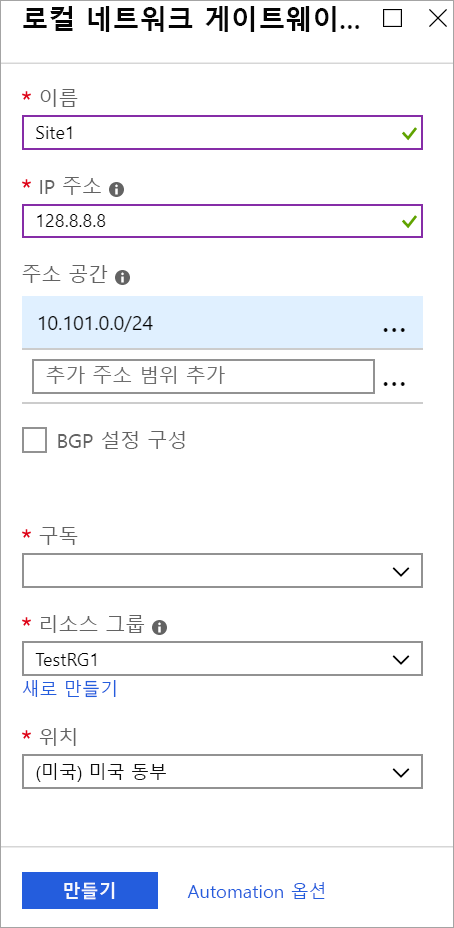

1. [Azure Portal](https://portal.azure.com) 메뉴에서 **리소스 만들기**를 선택 합니다. 

   
2. **Marketplace 검색** 필드에서 **로컬 네트워크 게이트웨이**를 입력 한 다음 **enter** 키를 눌러 검색 합니다. 그러면 결과 목록이 반환됩니다. **로컬 네트워크 게이트웨이**를 클릭한 다음, **만들기** 단추를 클릭하여 **로컬 네트워크 게이트웨이 만들기** 페이지를 엽니다.

   

3. **로컬 네트워크 게이트웨이 만들기 블레이드**에서 로컬 네트워크 게이트웨이의 값을 지정합니다.

   - **이름:** 로컬 네트워크 게이트웨이 개체의 이름을 지정합니다.
   - **IP 주소:** Azure를 연결하려는 VPN 디바이스의 공용 IP 주소입니다. 유효한 공용 IP 주소를 지정합니다. IP 주소가 지금 당장 없는 경우 예제에 표시된 값을 사용할 수 있지만 다시 이동해서 VPN 디바이스의 공용 IP 주소로 자리 표시자 IP 주소를 바꿔야 합니다. 그렇지 않으면 Azure를 연결할 수 없습니다.
   - **주소 공간** 은 이 로컬 네트워크가 나타내는 네트워크에 대한 주소 범위를 가리킵니다. 주소 공간 범위를 여러 개 추가할 수 있습니다. 여기에서 지정한 범위가 연결하려는 다른 네트워크의 범위와 겹치지 않는지 확인합니다. Azure는 지정한 주소 범위를 온-프레미스 VPN 디바이스 IP 주소에 라우팅합니다. *온-프레미스 사이트에 연결하려는 경우 예제에 표시된 값이 아니라 자체 값을 여기에 사용합니다*.
   - **BGP 설정 구성:** BGP를 구성할 때에만 사용합니다. 그렇지 않으면 이것을 선택하지 마십시오.
   - **구독:** 올바른 구독이 표시되어 있는지 확인합니다.
   - **리소스 그룹:** 사용하려는 리소스 그룹을 선택합니다. 새 리소스 그룹을 만들거나 이미 만든 리소스 그룹을 선택할 수 있습니다.
   - **위치:** 위치는 다른 설정의 **지역과** 동일 합니다. 이 개체를 만들 위치를 선택합니다. VNet이 있는 동일한 위치를 선택하는 것이 좋지만 그렇게 하지 않아도 됩니다.

4. 값을 지정하는 작업을 완료하면 페이지 맨 아래에서 **만들기** 단추를 클릭하여 로컬 네트워크 게이트웨이를 만듭니다.
