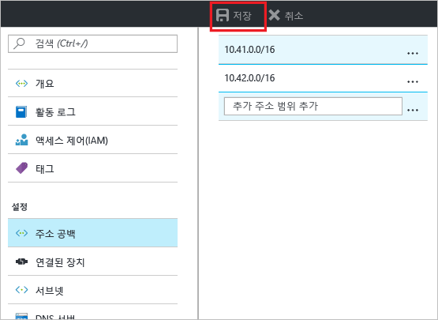
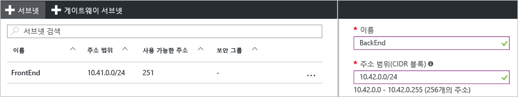

### 다른 주소 공간을 추가하려면

1. 주소 공간을 더 추가하려면 가상 네트워크 페이지에 대한 **설정** 섹션 아래에서 **주소 공간**을 클릭하여 주소 공간 페이지를 엽니다.
2. 추가 주소 공간을 추가한 다음 페이지의 맨 위에 있는 **저장**을 클릭합니다.

  

### 추가 서브넷을 만들려면

1. 서브넷을 만들려면 가상 네트워크 페이지의 **설정** 섹션에서 **서브넷**을 클릭하여 **서브넷** 페이지를 엽니다. 
2. 서브넷 페이지에서 **+서브넷**을 클릭하여 **서브넷 추가** 페이지를 엽니다. 새 서브넷 이름을 지정하고 주소 범위를 지정합니다.

  
3. 변경 내용을 저장하려면 페이지 아래쪽에서 **확인**을 클릭합니다.

  