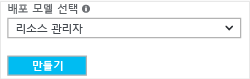

Azure Portal을 사용하여 Resource Manager 배포 모델에서 VNet을 만들려면 아래 단계를 따릅니다. 스크린샷은 예제로 제공됩니다. 사용자 고유의 값으로 대체해야 합니다. 가상 네트워크 작업에 대한 자세한 내용은 [Virtual Network 개요](../articles/virtual-network/virtual-networks-overview.md)를 참조하세요.

>[!NOTE]
>이 VNet을 온-프레미스 위치에 연결하려면 온-프레미스 네트워크 관리자와 협의하여 이 가상 네트워크에 특별히 사용할 수 있는 IP 주소 범위를 만들어야 합니다. VPN 연결의 양쪽 모두에 중복 주소 범위가 있는 경우 트래픽이 예상대로 라우팅되지 않습니다. 또한 이 VNet을 다른 VNet에 연결하려면 주소 공간이 다른 VNet과 겹치면 안됩니다. 이에 따라 네트워크 구성을 적절히 계획하도록 주의해야 합니다.
>
>

1. 브라우저에서 [Azure Portal](http://portal.azure.com)로 이동하고 필요한 경우 Azure 계정으로 로그인합니다.
2. 페이지 맨 아래에 있는 **+** 를 사용하여 응용 프로그램에 Single Sign-On 할 수 있습니다. **마켓플레이스 검색** 필드에 "Virtual Network"를 입력합니다. 반환된 목록에서 **Virtual Network**를 찾아서 클릭하여 **Virtual Network** 페이지를 엽니다.

  
3. Virtual Network 페이지 아래쪽 근처의 **배포 모델 선택** 목록에서 **리소스 관리자**를 선택한 다음 **만들기**를 클릭합니다.

  
4. **가상 네트워크 만들기** 페이지에서 VNet 설정을 구성합니다. 필드를 채울 때 필드에 입력한 문자가 유효하면 빨간색 느낌표가 녹색 확인 표시가 됩니다. 자동으로 채워진 값이 있을 수도 있습니다. 그렇다면, 사용자 고유의 값으로 대체합니다. **가상 네트워크 만들기** 페이지가 다음 예제와 유사하게 표시됩니다.

  
5. **이름**: 가상 네트워크의 이름을 입력합니다.
6. **주소 공간**: 주소 공간을 입력합니다. 추가할 주소 공간이 여러 개면 첫 번째 주소 공간을 추가합니다. 다른 주소 공간은 VNet을 만든 후 나중에 추가할 수 있습니다.
7. **구독**: 나열된 구독이 올바른지 확인합니다. 드롭다운을 사용하여 구독을 변경할 수 있습니다.
8. **리소스 그룹**: 기존 리소스 그룹을 선택하거나 새 리소스 그룹의 이름을 입력하여 새로 만듭니다. 새 그룹을 만드는 경우 계획된 구성 값에 따라 리소스 그룹의 이름을 지정합니다. 리소스 그룹에 대한 자세한 내용은 [Azure Resource Manager 개요](../articles/azure-resource-manager/resource-group-overview.md#resource-groups)를 참조하세요.
9. **위치**: VNet의 위치를 선택합니다. 이 위치는 VNet에 배포하는 리소스가 상주할 곳을 결정합니다.
10. **서브넷**: 서브넷 이름 및 서브넷 주소 범위를 추가합니다. VNet을 만든 후 나중에 서브넷을 추가할 수 있습니다.
11. 대시보드에서 VNet을 쉽게 찾을 수 있으려면 **대시보드에 고정**을 선택한 다음 **만들기**를 클릭합니다.

  