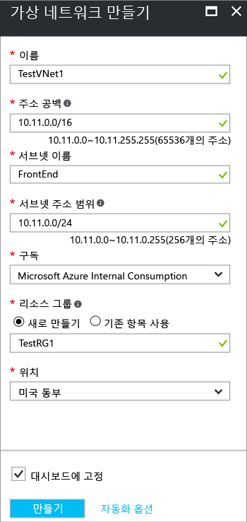

Azure 포털을 사용하여 Resource Manager 배포 모델에서 VNet을 만들려면 아래 단계를 따릅니다. 스크린샷은 예제로 제공됩니다. 사용자 고유의 값으로 대체해야 합니다. 가상 네트워크 작업에 대한 자세한 내용은 [가상 네트워크 개요](../articles/virtual-network/virtual-networks-overview.md)를 참조하세요.

1. 브라우저에서 [Azure 포털](http://portal.azure.com) 로 이동하고 Azure 계정으로 로그인합니다.
2. **새로 만들기**를 클릭합니다. **마켓플레이스 검색** 필드에 "Virtual Network"를 입력합니다. 반환된 목록에서 **Virtual Network**를 찾아서 클릭하여 **Virtual Network** 블레이드를 엽니다.
3. Virtual Network 블레이드의 아래쪽 근처의 **배포 모델 선택** 목록에서 **Resource Manager**를 선택한 다음 **만들기**를 클릭합니다.
4. **가상 네트워크 만들기** 블레이드에서 VNet 설정을 구성합니다. 필드를 채울 때 필드에 입력한 문자가 유효하면 빨간색 느낌표가 녹색 확인 표시가 됩니다.
5. **가상 네트워크 만들기** 블레이드가 다음 예제와 유사하게 표시됩니다. 자동으로 채워진 값이 있을 수도 있습니다. 그렇다면, 사용자 고유의 값으로 대체합니다.
   
    
6. **이름**: Virtual Network의 이름을 입력합니다.
7. **주소 공간**: 주소 공간을 입력합니다. 추가할 주소 공간이 여러 개면 첫 번째 주소 공간을 추가합니다. 다른 주소 공간은 VNet을 만든 후 나중에 추가할 수 있습니다. 지정한 주소 공간이 온-프레미스 위치의 주소 공간과 겹치지 않는지 확인합니다.
8. **서브넷 이름**: 서브넷 이름 및 서브넷 주소 범위를 추가합니다. VNet을 만든 후 나중에 서브넷을 추가할 수 있습니다.
9. **구독**: 나열된 구독이 올바른지 확인합니다. 드롭다운을 사용하여 구독을 변경할 수 있습니다.
10. **리소스 그룹**: 기존 리소스 그룹을 선택하거나 새 리소스 그룹의 이름을 입력하여 새로 만듭니다. 새 그룹을 만드는 경우 계획된 구성 값에 따라 리소스 그룹의 이름을 지정합니다. 리소스 그룹에 대한 자세한 내용은 [Azure 리소스 관리자 개요](../articles/azure-resource-manager/resource-group-overview.md#resource-groups)를 참조하세요.
11. **위치**: VNet의 위치를 선택합니다. 이 위치는 VNet에 배포하는 리소스가 상주할 곳을 결정합니다.
12. 대시보드에서 VNet을 쉽게 찾을 수 있으려면 **대시보드에 고정**을 선택한 다음 **만들기**를 클릭합니다.
13. **만들기**를 클릭한 후에 VNet의 진행 상황을 반영하는 대시보드에 타일이 표시됩니다. 타일은 VNet이 생성되면서 변경됩니다.