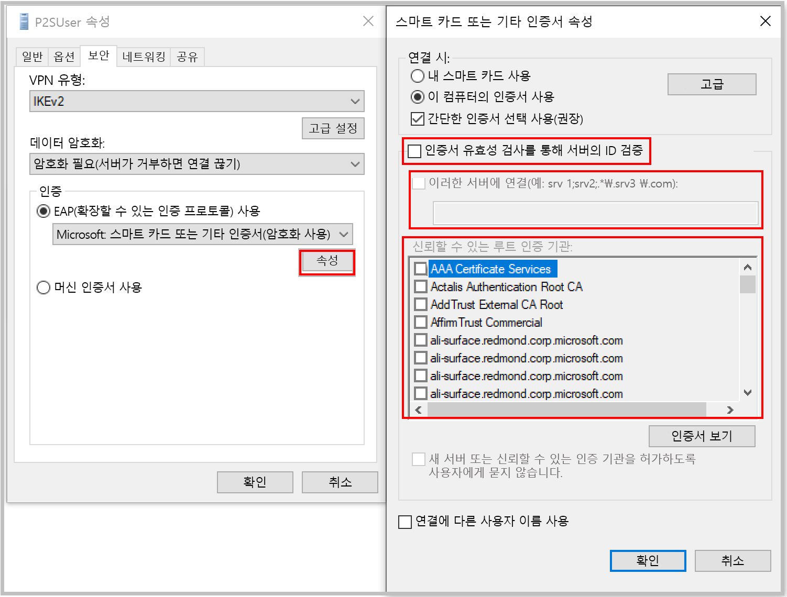

[!INCLUDE [P2S FAQ All](vpn-gateway-faq-p2s-all-include.md)]

### 인증서 인증을 사용 하 여 연결할 때 인증서 불일치를 가져오는 경우 어떻게 해야 하나요?

프로필을 수동으로 만들 때 **"인증서의 유효성을 검사 하 여 서버의 Id 확인"** 을 선택 취소 하거나 **인증서와 함께 서버 FQDN을 추가** 합니다. 명령 프롬프트에서 **rasphone** 를 실행 하 고 드롭다운 목록에서 프로필을 선택 하 여이 작업을 수행할 수 있습니다.

서버 id 유효성 검사를 무시 하는 것은 일반적으로 권장 되지 않지만 Azure 인증서 인증을 사용 하는 경우 VPN 터널링 프로토콜 (IKEv2/SSTP) 및 EAP 프로토콜의 서버 유효성 검사에 동일한 인증서가 사용 됩니다. 서버 인증서 및 FQDN은 이미 VPN 터널링 프로토콜에서 유효성 검사를 수행 하므로 EAP에서 다시 유효성을 검사 하는 것은 중복 됩니다.

### 자체 내부 PKI 루트 CA를 사용 하 여 지점 및 사이트 간 연결에 대 한 인증서를 생성할 수 있나요?

예. 이전에는 자체 서명한 루트 인증서만 사용할 수 있었습니다. 여전히 20개의 루트 인증서를 업로드할 수 있습니다.

### Azure Key Vault에서 인증서를 사용할 수 있나요?

아닙니다.

### 인증서를 만들려면 어떤 도구를 사용합니까?

You can use your Enterprise PKI 솔루션(사용자 인터넷 PKI), Azure PowerShell, MakeCert 및 OpenSSL을 사용할 수 있습니다.

### 인증서 설정 및 매개 변수에 대한 지침이 있습니까?

* **Internal PKI/Enterprise PKI 솔루션:** [인증서 생성](../articles/vpn-gateway/vpn-gateway-howto-point-to-site-resource-manager-portal.md#generatecert)단계를 봅니다.

* **Azure PowerShell:** 단계는 [Azure PowerShell](../articles/vpn-gateway/vpn-gateway-certificates-point-to-site.md) 문서를 참조하세요.

* **Makecert:** 단계는 [Makecert](../articles/vpn-gateway/vpn-gateway-certificates-point-to-site-makecert.md) 문서를 참조하세요.

* **OpenSSL:** 

    * 인증서를 내보낼 때는 루트 인증서를 Base64로 변환해야 합니다.

    * 클라이언트 인증서:

      * 프라이빗 키를 만들 때에는 길이를 4096으로 지정합니다.
      * 인증서를 만들 때에는 *-extensions* 매개 변수에 대해 *usr_cert*를 지정합니다.
