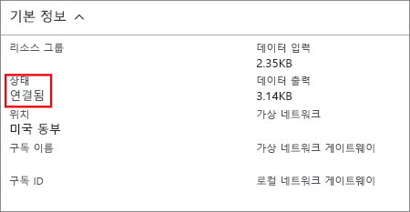

Azure Portal에서 연결로 이동하여 Resource Manager VPN Gateway의 연결 상태를 볼 수 있습니다. 다음 단계에서는 연결로 이동하고 확인하는 한 가지 방법을 보여 줍니다.

1. [Azure Portal](http://portal.azure.com)에서 **모든 리소스**를 클릭하고 가상 네트워크 게이트웨이로 이동합니다.
2. 가상 네트워크 게이트웨이에 대한 블레이드에서 **연결**을 클릭합니다. 각 연결의 상태를 볼 수 있습니다.
3. 확인하려는 연결의 이름을 클릭하여 **Essentials**을 엽니다. Essentials에서 연결에 대한 자세한 정보를 볼 수 있습니다. 연결에 성공하면 **상태**가 '성공함' 및 '연결됨'으로 표시됩니다.

   