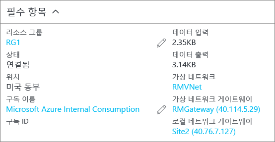

### PowerShell을 사용하여 연결을 확인하려면
`-Debug`와 함께 또는 없이 `Get-AzureRmVirtualNetworkGatewayConnection` cmdlet을 사용하여 연결이 성공했는지 확인할 수 있습니다. 

1. 일치하는 값을 구성하는 데 다음 cmdlet 예제를 사용합니다. 메시지가 표시되면 '모두' 실행하기 위해 A를 선택합니다. 예제에서 `-Name`은 만들고 테스트한 연결의 이름을 참조합니다.
   
        Get-AzureRmVirtualNetworkGatewayConnection -Name MyGWConnection -ResourceGroupName MyRG
2. cmdlet이 완료되면 값을 봅니다. 아래 예제에서는 연결 상태가 '연결됨'으로 표시되고 송/수신 바이트를 볼 수 있습니다.
   
        Body:
        {
          "name": "MyGWConnection",
          "id":
        "/subscriptions/086cfaa0-0d1d-4b1c-94544-f8e3da2a0c7789/resourceGroups/MyRG/providers/Microsoft.Network/connections/MyGWConnection",
          "properties": {
            "provisioningState": "Succeeded",
            "resourceGuid": "1c484f82-23ec-47e2-8cd8-231107450446b",
            "virtualNetworkGateway1": {
              "id":
        "/subscriptions/086cfaa0-0d1d-4b1c-94544-f8e3da2a0c7789/resourceGroups/MyRG/providers/Microsoft.Network/virtualNetworkGa
        teways/vnetgw1"
            },
            "localNetworkGateway2": {
              "id":
        "/subscriptions/086cfaa0-0d1d-4b1c-94544-f8e3da2a0c7789/resourceGroups/MyRG/providers/Microsoft.Network/localNetworkGate
        ways/LocalSite"
            },
            "connectionType": "IPsec",
            "routingWeight": 10,
            "sharedKey": "abc123",
            "connectionStatus": "Connected",
            "ingressBytesTransferred": 33509044,
            "egressBytesTransferred": 4142431
          }

### Azure 포털을 사용하여 연결을 확인하려면
Azure 포털에서 연결로 이동하여 연결 상태를 볼 수 있습니다. 여러 가지 방법으로 이 작업을 수행할 수 있습니다. 다음 단계에서는 연결로 이동하고 확인하는 한 가지 방법을 보여 줍니다.

1. [Azure Portal](http://portal.azure.com)에서 **모든 리소스**를 클릭하고 가상 네트워크 게이트웨이로 이동합니다.
2. 가상 네트워크 게이트웨이에 대한 블레이드에서 **연결**을 클릭합니다. 각 연결의 상태를 볼 수 있습니다.
3. 확인하려는 연결의 이름을 클릭하여 **Essentials**을 엽니다. Essentials에서 연결에 대한 자세한 정보를 볼 수 있습니다. 연결에 성공하면 **상태**가 '성공함' 및 '연결됨'으로 표시됩니다.
   
    

<!--HONumber=Nov16_HO2-->

